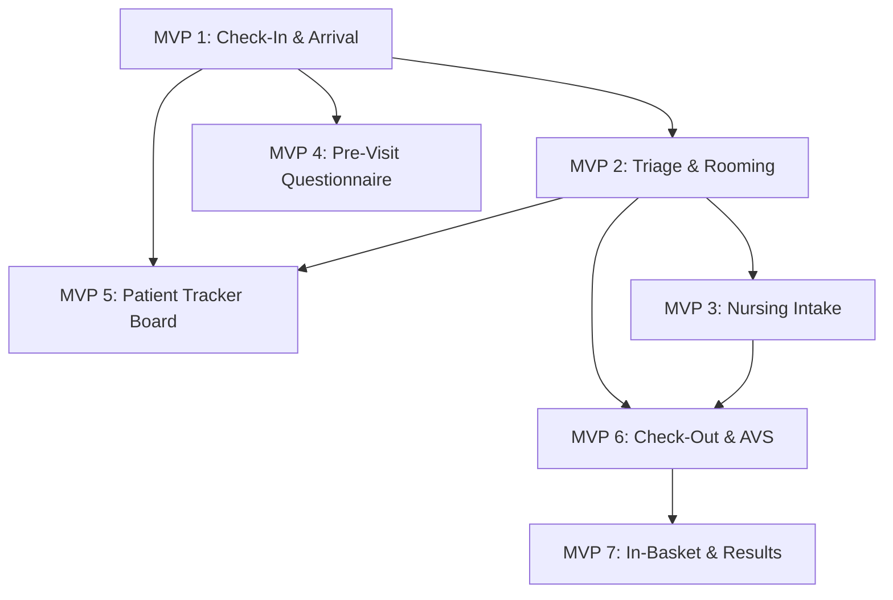

# Clinical Visit Workflow — Gap Analysis & MVP Roadmap

> **Source workflow:** Epic Cadence → Prelude → Navigator → EpicCare → Beaker/Radiant → Discharge  
> **Analyzed against:** DevFaso/hms `develop` branch (2026-04-10)  
> **Author:** HMS Planner Agent

---

## Executive Summary

The myInput.md describes a 10-step clinical visit workflow modeled on Epic's outpatient flow (Cadence scheduling → Prelude check-in → Navigator triage → EpicCare evaluation → Beaker/Radiant orders → disposition/check-out). DevFaso/hms already covers **appointment scheduling**, **encounters**, **vital signs**, **lab/imaging orders**, **prescriptions**, and **billing** — but several critical workflow steps have incomplete or missing support for the *real-time, event-driven patient-tracking* that ties these pieces together. We identify **7 MVPs** to close the gaps, ordered by clinical priority and dependency.

---

## Workflow Step-by-Step — Existing Support & Gaps

| # | Workflow Step | Epic Module | HMS Status | Key Gap |
|---|---|---|---|---|
| 1 | **Appointment Scheduling** | Cadence | ✅ Supported | Appointment CRUD, status transitions (SCHEDULED → CONFIRMED → IN_PROGRESS → COMPLETED/CANCELLED/NO_SHOW), conflict checks, email notifications all exist. Minor: no recurring-series or template support. |
| 2 | **Pre-Arrival / Pre-Check-In** | MyChart / Hello Patient | ⚠️ Partial | Patient portal exists (book, cancel, reschedule, view records, consent, vitals). Missing: **pre-visit questionnaire** engine (structured intake forms patients fill out before arrival), **insurance eligibility auto-verify**, and **pre-check-in status flag** on the appointment. |
| 3 | **Arrival & Check-In** | Prelude (Registration) | ⚠️ Partial | ReceptionService has dashboard summary, queue, patient snapshot, insurance issues panel, flow board, walk-in dialog, and eligibility attestation. Missing: **formal check-in action** that transitions appointment to CHECKED_IN, timestamps arrival, triggers ADT event, and captures co-pay/demographics updates in one atomic operation. AppointmentStatus enum lacks `CHECKED_IN`. |
| 4 | **Waiting Room / Patient Tracking** | Patient Tracker | ⚠️ Partial | Flow board (ReceptionService.getFlowBoard) and PatientFlowService exist. EncounterStatus has ARRIVED, TRIAGE, WAITING_FOR_PHYSICIAN, IN_PROGRESS, etc. Missing: **real-time wait-time calculation** (arrival timestamp → roomed timestamp), **patient-tracker board** visible to all clinical staff with current location/status, **estimated wait notifications** to patient portal. |
| 5 | **Triage / Rooming** | Navigator (Triage) | ⚠️ Partial | EncounterStatus.TRIAGE exists. PatientVitalSign entity/service/controller fully implemented. EncounterUrgency enum (EMERGENT, URGENT, ROUTINE, LOW) exists. Missing: **dedicated triage form/endpoint** that captures vitals + chief complaint + acuity level + fall risk in one atomic triage submission linked to the encounter, plus an encounter status auto-transition (ARRIVED → TRIAGE). No **ESI score** field. |
| 6 | **Nursing Intake** | Flowsheets / SmartForms | ⚠️ Partial | Nurse dashboard, nurse tasks, vital signs recording all exist. Allergy and medication services exist. Missing: **structured intake flowsheet** (combined form: allergies update + meds reconciliation + chief complaint documentation + nursing assessment notes) as a single intake event linked to the encounter. Currently these are separate disjoint operations. |
| 7 | **Clinician Evaluation** | EpicCare Ambulatory | ⚠️ Partial | EncounterNote entity exists. Doctor worklist exists. Prescriptions, lab orders, imaging orders, procedure orders all exist. Missing: **structured HPI/ROS/exam SmartForm** template, **in-encounter order placement** that auto-links orders to the active encounter, and **encounter-scoped chart review** (consolidated view of patient history within the encounter context). |
| 8 | **Labs/Imaging & Results** | Beaker / Radiant | ✅ Mostly Supported | Lab test definitions, QC events, validation studies, lab ordering, imaging ordering all exist. Lab results returned to patient portal. Missing: **result auto-notification** to ordering provider (In-Basket equivalent), **STAT/urgent priority routing**, and **specimen tracking** (collection → processing → resulted). |
| 9 | **Clinician Review of Results** | Chart Review / In-Basket | ⚠️ Partial | Doctor results panel exists on dashboard. Missing: **In-Basket/notification system** for new results requiring review + sign-off, **result acknowledgment tracking** (who reviewed, when), and **critical-value alerting** (auto-page/notify on panic values). |
| 10 | **Disposition / Check-Out** | Cadence + ADT | ⚠️ Partial | Encounter can be COMPLETED. Appointment can be COMPLETED. Follow-up appointment creation exists. Missing: **check-out workflow** (generate visit summary/AVS, print/send discharge instructions, schedule follow-up in one flow), **ADT discharge event**, **after-visit summary** document generation, and **co-pay reconciliation at check-out**. |

### Variation Gaps

| Variation | HMS Status | Gap |
|---|---|---|
| **Walk-In Patients** | ⚠️ Partial | Walk-in encounter creation exists in reception (walkin-dialog). Missing: walk-in → triage → encounter lifecycle without a pre-existing appointment. Reception flow-board shows walk-ins but no dedicated walk-in registration form capturing demographics + insurance + chief complaint atomically. |
| **Late Arrival** | ❌ Missing | No late-arrival handling. No timestamp tracking of scheduled vs. actual arrival time. No configurable late threshold. |
| **No-Show** | ✅ Supported | AppointmentStatus.NO_SHOW exists. Can be set via status transition. |
| **Urgent Triage Bypass** | ⚠️ Partial | EncounterUrgency.EMERGENT/URGENT exist. Missing: auto-expedite logic that bypasses normal queue ordering based on acuity. |

---

## MVP Roadmap (Priority Order)

### MVP 1: Patient Check-In & Arrival Workflow ✅ COMPLETE
**Goal:** Provide a formal, atomic check-in action that transitions a patient from "scheduled" to "arrived/checked-in" with all required data capture.

**Status:** ✅ **Implemented & verified** (2026-04-11) — backend BUILD SUCCESSFUL (502 test suites, 0 failures), frontend build pass, ESLint pass.

**Priority:** 🔴 Critical — This is the foundational gap. Without a proper check-in step, the rest of the workflow (triage → evaluation → disposition) has no reliable starting event.

**Complexity:** Medium  
**Estimated Effort:** 8 story points  

**Scope:**
- Add `CHECKED_IN` to `AppointmentStatus` enum
- New `CheckInRequestDTO` capturing: identity confirmation, insurance verification, co-pay amount, demographics updates, chief complaint, arrival timestamp
- New `CheckInResponseDTO` with appointment + encounter summary
- Service method that atomically: (a) transitions appointment SCHEDULED/CONFIRMED → CHECKED_IN, (b) creates an Encounter with status ARRIVED, (c) timestamps arrival, (d) updates patient demographics if changed, (e) records co-pay if collected
- Reception controller endpoint: `POST /api/reception/check-in`
- Frontend: Check-In button on reception queue → opens check-in dialog → submits → updates queue

**User Stories:**
1. As a Receptionist, I want to check in a patient for their scheduled appointment so that clinical staff know the patient has arrived.
2. As a Receptionist, I want to capture updated demographics and insurance at check-in so records are current.
3. As a Receptionist, I want to record co-pay collection at check-in so billing is accurate.
4. As a Receptionist, I want walk-in patients to go through the same check-in flow (without a pre-existing appointment) so all arrivals are tracked consistently.

**Acceptance Criteria:**
- Check-in transitions appointment to CHECKED_IN and creates ARRIVED encounter in one transaction
- Arrival timestamp is recorded on the encounter
- Co-pay amount is recorded (linked to billing)
- Demographics changes are persisted to Patient entity
- Walk-in check-in creates both an ad-hoc appointment and encounter
- Reception queue updates in real-time after check-in
- Unauthorized roles (PATIENT, DOCTOR) cannot call check-in endpoint

**Risk Flags:**
- ⚠️ PHI — Demographics update touches patient PII fields
- ⚠️ Auth — New endpoint must be restricted to ROLE_RECEPTIONIST, ROLE_HOSPITAL_ADMIN, ROLE_SUPER_ADMIN
- ⚠️ Billing — Co-pay collection creates financial record

**Dependencies:** None (foundational MVP)

**Implementation Details (completed 2026-04-11):**

| Layer | File(s) | Change |
|---|---|---|
| Migration | `V36__mvp1_checkin_columns.sql` | Added `checked_in_at` to appointments, `arrival_timestamp` + `chief_complaint` to encounters |
| Enum | `AppointmentStatus.java` | Added `CHECKED_IN` |
| Entity | `Appointment.java` | Added `checkedInAt` field |
| Entity | `Encounter.java` | Added `arrivalTimestamp`, `chiefComplaint` fields |
| DTO | `CheckInRequestDTO.java` (new) | appointmentId, chiefComplaint, coPayAmount, demographicsUpdated, insuranceVerified |
| DTO | `CheckInResponseDTO.java` (new) | Full response with appointment + encounter summary |
| DTO | `AppointmentResponseDTO.java` | Added `checkedInAt` |
| DTO | `EncounterResponseDTO.java` | Added `arrivalTimestamp`, `chiefComplaint` |
| Service | `ReceptionService.java` | Added `checkInPatient()` interface method |
| Service | `ReceptionServiceImpl.java` | Implemented atomic check-in: validates status, creates ARRIVED encounter, sets timestamps |
| Controller | `ReceptionController.java` | `POST /api/reception/check-in` — RECEPTIONIST, HOSPITAL_ADMIN, ADMIN, SUPER_ADMIN |
| Mapper | `AppointmentMapper.java` | Maps `checkedInAt` |
| Mapper | `EncounterMapper.java` | Maps `arrivalTimestamp`, `chiefComplaint` |
| Frontend Model | `reception.service.ts` | `CheckInRequest`, `CheckInResponse` interfaces, `CHECKED_IN` in QueueStatus |
| Frontend Service | `reception.service.ts` | `checkInPatient()` method |
| Frontend UI | `checkin-dialog.component.*` (4 files, new) | Dialog with chief complaint + co-pay form |
| Backend Tests | `ReceptionServiceImplTest.java` | 4 tests: happy path, not-found, already checked-in, cancelled |
| Frontend Tests | `checkin-dialog.component.spec.ts` (new) | 3 tests: creation, defaults, dismiss |
| Existing Test Fix | `EncounterTest.java` | Updated all-args constructor call for new fields |

---

### MVP 2: Triage & Rooming Workflow ✅ COMPLETE
**Status:** ✅ Complete — 2026-04-11 | Backend: 3 326 tests, 0 failures | Frontend: ng build ✅, lint ✅

**Goal:** Provide a single triage submission that captures vitals + chief complaint + acuity in one atomic operation and transitions the encounter through triage.

**Priority:** 🔴 Critical — Triage is the clinical gateway; without it, the system cannot differentiate urgency or track the patient's journey from waiting room to exam room.

**Complexity:** Medium  
**Estimated Effort:** 8 story points  

**Scope:**
- New `TriageSubmissionRequestDTO`: vital signs (BP systolic/diastolic, HR, temp, SpO2, RR, weight, height, pain scale), chief complaint text, acuity level (ESI 1-5), fall risk (boolean + score), room assignment
- New `TriageSubmissionResponseDTO`: encounter ID, triage timestamp, acuity, room
- Service method that atomically: (a) records vitals (PatientVitalSign), (b) updates encounter chief complaint, (c) sets EncounterUrgency based on ESI mapping, (d) transitions encounter ARRIVED → TRIAGE → WAITING_FOR_PHYSICIAN, (e) records room assignment, (f) timestamps triage completion
- Add `esi_score` column to encounters table (nullable integer 1-5)
- Add `room_assignment` column to encounters table (nullable varchar)
- Add `triage_timestamp`, `roomed_timestamp` to encounters table
- Controller endpoint: `POST /api/encounters/{id}/triage`
- Frontend: Triage form accessible from nurse station / flow board → submit → encounter card moves to "Waiting for Physician" lane

**User Stories:**
1. As a Nurse, I want to submit all triage data (vitals, complaint, acuity) in one form so I don't have to navigate multiple screens.
2. As a Nurse, I want the encounter status to auto-advance to "Waiting for Physician" after triage so the doctor knows the patient is ready.
3. As an ED Nurse, I want to assign an ESI score so high-acuity patients are seen first.
4. As a Nurse, I want to record the exam room number so staff can locate the patient.

**Acceptance Criteria:**
- Triage submission creates PatientVitalSign record linked to encounter
- Encounter status transitions ARRIVED → TRIAGE (during entry) → WAITING_FOR_PHYSICIAN (on completion)
- ESI score (1-5) is stored on encounter; EMERGENT/URGENT map to ESI 1-2
- Room assignment is stored on encounter
- Triage timestamp is recorded
- Flow board / patient tracker reflects new status immediately
- Only ROLE_NURSE, ROLE_DOCTOR, ROLE_SUPER_ADMIN can submit triage

**Risk Flags:**
- ⚠️ PHI — Chief complaint is clinical data
- ⚠️ DB Migration — New columns on encounters table (high-traffic table)

**Dependencies:** MVP 1 (check-in creates the ARRIVED encounter that triage acts on)

**Implementation Details (completed 2026-04-11):**

| Layer | File(s) | Change |
|---|---|---|
| Migration | `V37__mvp2_triage_columns.sql` | Added `esi_score`, `room_assignment`, `triage_timestamp`, `roomed_timestamp` to encounters + partial indexes |
| Changelog | `changelog.xml` | Added V36 + V37 changeSet entries |
| Entity | `Encounter.java` | Added `esiScore`, `roomAssignment`, `triageTimestamp`, `roomedTimestamp` fields |
| DTO | `TriageSubmissionRequestDTO.java` (new) | Vitals (9 fields), chiefComplaint, esiScore (1-5), fallRisk, fallRiskScore, roomAssignment |
| DTO | `TriageSubmissionResponseDTO.java` (new) | encounterId, encounterStatus, esiScore, urgency, roomAssignment, triageTimestamp, roomedTimestamp, chiefComplaint, vitalSignId |
| DTO | `EncounterResponseDTO.java` | Added esiScore, roomAssignment, triageTimestamp, roomedTimestamp, urgency |
| Service | `EncounterService.java` | Added `submitTriage()` interface method |
| Service | `EncounterServiceImpl.java` | Implemented atomic triage: validates ARRIVED/TRIAGE status, creates PatientVitalSign, maps ESI→urgency, transitions to WAITING_FOR_PHYSICIAN, records timestamps |
| Controller | `EncounterController.java` | `POST /api/encounters/{id}/triage` — NURSE, DOCTOR, SUPER_ADMIN |
| Mapper | `EncounterMapper.java` | Maps esiScore, roomAssignment, triageTimestamp, roomedTimestamp, urgency |
| Frontend Model | `encounter.service.ts` | `EncounterUrgency` type, `TriageSubmissionRequest`/`Response` interfaces, 7 new fields on `EncounterResponse` |
| Frontend Service | `encounter.service.ts` | `submitTriage()` method |
| Frontend UI | `triage-form.component.*` (4 files, new) | Overlay dialog with ESI selector, 9-field vitals grid, fall risk, room assignment |
| Backend Tests | `EncounterServiceImplTest.java` | 5 tests: happy path (ARRIVED), happy path (TRIAGE), not-found, invalid status, ESI mapping |
| Frontend Tests | `triage-form.component.spec.ts` (new) | 7 tests: creation, validation, save guard, no-encounter guard, happy path, error toast, generic error fallback |
| Existing Test Fix | `EncounterTest.java` | Updated all-args constructor for 4 new fields |

---

### MVP 3: Nursing Intake Flowsheet
**Goal:** Provide a structured nursing intake form that combines allergy/medication reconciliation, chief complaint documentation, and nursing assessment into one encounter-linked submission.

**Priority:** 🟡 High — Bridges the gap between triage and physician evaluation.

**Complexity:** Medium  
**Estimated Effort:** 6 story points  

**Scope:**
- New `NursingIntakeRequestDTO`: allergies update list, medications reconciliation list, chief complaint detail text, nursing assessment notes, pain assessment, fall risk detail
- New `NursingIntakeResponseDTO`: encounter ID, intake timestamp, updated allergy count, updated med count
- Service method that: (a) bulk-updates/adds patient allergies, (b) reconciles medication list, (c) records nursing assessment note on encounter, (d) timestamps intake completion
- New `nursing_intake_timestamp` column on encounters table
- Controller endpoint: `POST /api/encounters/{id}/nursing-intake`
- Frontend: Intake form on nurse station for the encounter → pre-populated with existing allergies/meds → submit

**User Stories:**
1. As a Nurse, I want to reconcile the patient's medication list during intake so the physician has accurate data.
2. As a Nurse, I want to update allergies at intake time so the clinical record is current before evaluation.
3. As a Nurse, I want to document my nursing assessment linked to this specific encounter.

**Acceptance Criteria:**
- Intake submission updates Patient allergies and medications in bulk
- Nursing assessment note is stored as an EncounterNote or dedicated field
- Intake timestamp recorded on encounter
- Pre-populated with existing patient data (allergies, meds)
- Only ROLE_NURSE, ROLE_DOCTOR, ROLE_SUPER_ADMIN can submit

**Risk Flags:**
- ⚠️ PHI — Medication and allergy data is sensitive clinical information

**Dependencies:** MVP 2 (triage must be completed before intake, or at minimum encounter must exist)

**Implementation Details (completed 2026-04-10):**

| Layer | File(s) | Change |
|---|---|---|
| Migration | `V38__mvp3_nursing_intake_column.sql` | Added `nursing_intake_timestamp` to encounters + partial index |
| Changelog | `changelog.xml` | Added V38 changeSet entry |
| Entity | `Encounter.java` | Added `nursingIntakeTimestamp` field (LocalDateTime) |
| DTO | `NursingIntakeRequestDTO.java` (new) | Allergies list (reuses `PatientAllergyRequestDTO`), medications reconciliation list (inner `MedicationReconciliationEntry`), nursingAssessmentNotes, chiefComplaint, painAssessment, fallRiskDetail |
| DTO | `NursingIntakeResponseDTO.java` (new) | encounterId, encounterStatus, intakeTimestamp, allergyCount, medicationCount, nursingNoteRecorded |
| DTO | `EncounterResponseDTO.java` | Added `nursingIntakeTimestamp` |
| Service | `EncounterService.java` | Added `submitNursingIntake()` interface method |
| Service | `EncounterServiceImpl.java` | Implemented nursing intake: validates WAITING_FOR_PHYSICIAN/TRIAGE/IN_PROGRESS status, bulk-saves allergies via PatientAllergyRepository, counts medication reconciliation, builds combined nursing note (assessment + pain + fall risk + meds), updates chiefComplaint, timestamps intake |
| Controller | `EncounterController.java` | `POST /api/encounters/{id}/nursing-intake` — NURSE, DOCTOR, SUPER_ADMIN |
| Mapper | `EncounterMapper.java` | Maps `nursingIntakeTimestamp` |
| Frontend Model | `encounter.service.ts` | `NursingIntakeRequest`/`Response`, `AllergyEntry`, `MedicationReconciliationEntry` interfaces, `nursingIntakeTimestamp` field |
| Frontend Service | `encounter.service.ts` | `submitNursingIntake()` method |
| Frontend UI | `nursing-intake-form.component.*` (4 files, new) | Overlay dialog with allergy add/remove list, medication reconciliation list, nursing assessment, pain assessment, fall risk, chief complaint detail |
| Integration | `nurse-station.ts` + `nurse-station.html` | Imported TriageFormComponent + NursingIntakeFormComponent; added Triage/Intake buttons on workboard cards; added dialog state signals and encounter lookup helper; wired overlay dialogs at page level |
| Backend Tests | `EncounterServiceImplTest.java` | 6 tests: happy path, not-found, invalid status, allergy persistence, TRIAGE status allowed, empty request (no note) |
| Frontend Tests | `nursing-intake-form.component.spec.ts` (new) | 9 tests: creation, canSubmit, save guard, no-encounter guard, add/remove allergies, add/remove medications, happy path, error toast, generic error, trackByIndex |
| Existing Test Fix | `EncounterTest.java` | Updated all-args constructor (+1 null for nursingIntakeTimestamp) |

---

### MVP 4: Pre-Visit Questionnaire & Pre-Check-In ✅ COMPLETE
**Status:** ✅ Complete — 2026-04-11 | Backend: BUILD SUCCESSFUL, 0 failures | Frontend: ng build ✅, lint ✅, 352 tests pass

**Goal:** Allow patients to complete pre-visit questionnaires and pre-check-in via the patient portal before their appointment.

**Priority:** 🟡 High — Reduces check-in time and improves data quality.

**Complexity:** Medium-High  
**Estimated Effort:** 10 story points  

**Scope:**
- New `Questionnaire` entity: id, title, questions (JSON), version, active, departmentId
- New `QuestionnaireResponse` entity: id, questionnaireId, patientId, appointmentId, responses (JSON), submittedAt
- New `PreCheckInRequestDTO`: updated demographics, insurance info, questionnaire responses, consent acknowledgments
- Service for questionnaire management (CRUD by admin) and patient submission
- Patient portal endpoints: `GET /api/patient-portal/appointments/{id}/questionnaires`, `POST /api/patient-portal/appointments/{id}/pre-checkin`
- Add `pre_checked_in` boolean and `pre_checkin_timestamp` to appointments table
- Frontend (patient portal): Pre-check-in card on upcoming appointments → demographics form + questionnaire → submit
- Frontend (reception): Pre-check-in status visible on reception queue (green badge)

**User Stories:**
1. As a Patient, I want to update my contact info and insurance before my visit so I spend less time at the front desk.
2. As a Patient, I want to fill out intake questionnaires at home so my visit is more efficient.
3. As a Receptionist, I want to see which patients have pre-checked-in so I can fast-track their arrival.

**Acceptance Criteria:**
- Patients can submit pre-check-in 1-7 days before appointment
- Questionnaire responses are stored and visible to clinical staff
- Pre-check-in status visible on reception queue
- At arrival, receptionist confirms (not re-enters) pre-submitted data
- Only the patient who owns the appointment can pre-check-in

**Risk Flags:**
- ⚠️ PHI — Patient-entered demographics and clinical questionnaire data
- ⚠️ New entities — Questionnaire and QuestionnaireResponse require DB migrations

**Dependencies:** MVP 1 (check-in flow should honor pre-check-in data)

**Implementation Details (completed 2026-04-11):**

| Layer | File(s) | Change |
|---|---|---|
| Migration | `V39__mvp4_questionnaires_and_precheckin.sql` | Creates `clinical.questionnaires` (JSONB questions, department/hospital FK, indexes), `clinical.questionnaire_responses` (JSONB responses, unique constraint on questionnaire+appointment), ALTERs `clinical.appointments` adding `pre_checked_in` + `pre_checkin_timestamp` |
| Changelog | `changelog.xml` | Added V39 changeSet entry |
| Entity | `Questionnaire.java` (new) | @JdbcTypeCode(SqlTypes.JSON) for questions, @Builder.Default for version=1 and active=true, ManyToOne department (nullable) + hospital (required) |
| Entity | `QuestionnaireResponse.java` (new) | ManyToOne questionnaire/patient/appointment, JSONB responses, submittedAt, unique constraint |
| Entity | `Appointment.java` | Added `preCheckedIn` (Boolean, default false) and `preCheckinTimestamp` (LocalDateTime) |
| Repository | `QuestionnaireRepository.java` (new) | findByHospital_IdAndActiveTrue, findByHospital_IdAndDepartment_IdAndActiveTrue |
| Repository | `QuestionnaireResponseRepository.java` (new) | findByAppointment_Id, existsByQuestionnaire_IdAndAppointment_Id |
| DTO | `QuestionnaireDTO.java` (new) | id, title, description, questions (JSON string), version, departmentId, departmentName |
| DTO | `QuestionnaireSubmissionDTO.java` (new) | questionnaireId, responses (JSON string) |
| DTO | `PreCheckInRequestDTO.java` (new) | appointmentId, demographics (phone/email/address/city/state/zip/country), emergency contact, insurance, questionnaireResponses list, consentAcknowledged |
| DTO | `PreCheckInResponseDTO.java` (new) | appointmentId, appointmentStatus, preCheckedIn, preCheckinTimestamp, questionnaireResponsesSubmitted, demographicsUpdated |
| DTO | `AppointmentResponseDTO.java` | Added preCheckedIn, preCheckinTimestamp fields |
| Service | `PatientPortalService.java` | Added `getQuestionnairesForAppointment()`, `submitPreCheckIn()` |
| Service | `PatientPortalServiceImpl.java` | getQuestionnairesForAppointment: ownership check, department-specific + hospital-wide merge with dedup; submitPreCheckIn: ownership check, SCHEDULED/CONFIRMED validation, 1-7 day timing window, demographics update, questionnaire response saving with idempotency, pre-checkin flag + timestamp |
| Controller | `PatientPortalController.java` | `GET /me/patient/appointments/{id}/questionnaires`, `POST /me/patient/appointments/{id}/pre-checkin` — ROLE_PATIENT |
| Mapper | `QuestionnaireMapper.java` (new) | @Component with toDto mapping |
| Mapper | `AppointmentMapper.java` | Maps preCheckedIn, preCheckinTimestamp |
| Frontend Model | `patient-portal.service.ts` | QuestionnaireQuestion, QuestionnaireDTO, QuestionnaireSubmission, PreCheckInRequest, PreCheckInResponse interfaces; preCheckedIn on PortalAppointment |
| Frontend Service | `patient-portal.service.ts` | `getQuestionnairesForAppointment()`, `submitPreCheckIn()` methods |
| Frontend UI | `pre-checkin-form.component.*` (4 files, new) | 3-step wizard (demographics → questionnaires → review), dynamic questionnaire rendering (YES_NO/TEXT/NUMBER), overlay dialog pattern |
| Integration | `my-appointments.component.*` | Pre-check-in button on SCHEDULED/CONFIRMED appointments, "Pre-check-in completed" indicator, overlay dialog wiring |
| Backend Tests | `PatientPortalServiceImplMvp4Test.java` (new) | 15 tests: 5 GetQuestionnaires tests, 10 SubmitPreCheckIn tests |
| Frontend Tests | `pre-checkin-form.component.spec.ts` (new) | 12 tests: creation, questionnaire loading, parsing, answer init, step navigation, answer updates, consent gating, dismiss, submit success, error handling, saving guard, null appointment guard |
| Existing Test Fixes | `PatientPortalServiceImplPhase1Test.java`, `PatientPortalServiceImplPhase2Test.java` | Added @Mock fields for new repository/mapper dependencies (constructor injection) |
| Existing Test Fix | `nurse-station.spec.ts` | Added EncounterService mock (from MVP 3 integration) |

---

### MVP 5: Real-Time Patient Tracker Board
**Goal:** Provide a hospital-wide, real-time patient tracker showing each patient's current status, location, wait time, and assigned provider.

**Priority:** 🟡 High — Essential for clinical operations coordination.

**Complexity:** High  
**Estimated Effort:** 10 story points  

**Scope:**
- New `PatientTrackerDTO`: patientId, patientName, MRN, appointmentId, encounterId, currentStatus, roomAssignment, assignedProvider, arrivalTimestamp, triageTimestamp, currentWaitMinutes, acuityLevel, departmentName
- Service that aggregates: active encounters (today, not COMPLETED/CANCELLED) + appointment data + room assignments + timestamps → computes wait times
- Endpoint: `GET /api/patient-tracker?hospitalId=&departmentId=&date=`
- WebSocket/SSE channel for real-time updates (push encounter status changes to connected boards)
- Frontend: Full-screen patient tracker board component with status columns (Checked In → Triage → Waiting → In Progress → Awaiting Results → Ready for Discharge → Completed)
- Color-coded by acuity; wait time warnings (yellow > 15 min, red > 30 min)
- Filters: department, provider, status

**User Stories:**
1. As a Charge Nurse, I want to see all patients currently in the department and their status so I can manage flow.
2. As a Physician, I want to see which patients are waiting for me so I can prioritize.
3. As a Receptionist, I want to see real-time wait times so I can inform patients.
4. As a Clinic Manager, I want to see bottleneck lanes so I can reallocate staff.

**Acceptance Criteria:**
- Board shows all active patients for the day with current status
- Wait time calculated from arrival timestamp to current time (or to next status transition)
- Board updates within 5 seconds of a status change
- Acuity-based color coding
- Accessible to ROLE_DOCTOR, ROLE_NURSE, ROLE_RECEPTIONIST, ROLE_HOSPITAL_ADMIN, ROLE_SUPER_ADMIN

**Risk Flags:**
- ⚠️ PHI — Patient names and locations visible on screen (ensure screen-lock policy)
- ⚠️ Performance — Real-time aggregation on large patient volumes; consider caching/materialized views

**Dependencies:** MVP 1 (arrival timestamps), MVP 2 (triage timestamps, room assignments)

**Implementation Details (completed 2026-04-12):**

| Layer | File(s) | Change |
|---|---|---|
| Migration | — | No new migration — MVP 5 is aggregation-only over existing encounter data |
| DTO | `PatientTrackerItemDTO.java` (new) | patientId, patientName, mrn, appointmentId, encounterId, currentStatus, roomAssignment, assignedProvider, departmentName, arrivalTimestamp, triageTimestamp, currentWaitMinutes, acuityLevel, preCheckedIn |
| DTO | `PatientTrackerBoardDTO.java` (new) | 6 status-lane lists (arrived, triage, waitingForPhysician, inProgress, awaitingResults, readyForDischarge), totalPatients, averageWaitMinutes |
| Mapper | `PatientTrackerMapper.java` (new) | @Component, toTrackerItem() maps Encounter→DTO, deriveAcuityLevel (ESI score → "ESI-N", urgency fallback, default ROUTINE), computeWaitMinutes from arrival/encounter timestamps |
| Service | `PatientTrackerService.java` (new) | Interface: getTrackerBoard(hospitalId, departmentId, date) |
| Service | `PatientTrackerServiceImpl.java` (new) | Queries findAllByHospitalAndDateRange, filters COMPLETED/CANCELLED, optional dept filter, groups into 6 lanes, computes avg wait |
| Controller | `PatientTrackerController.java` (new) | GET /patient-tracker, @PreAuthorize multi-role (DOCTOR, NURSE, RECEPTIONIST, HOSPITAL_ADMIN, ADMIN, SUPER_ADMIN, MIDWIFE), uses ControllerAuthUtils.resolveHospitalScope |
| Repository | `EncounterRepository.java` (modified) | Added `findAllByHospitalAndDateRange` with JOIN FETCH for patient, hospitalRegistrations, staff.user, department, appointment |
| Frontend Model | `patient-tracker.service.ts` (new) | PatientTrackerItem, PatientTrackerBoard interfaces; getTrackerBoard() method |
| Frontend UI | `patient-tracker.component.*` (4 files, new) | Kanban board with 6 status columns, 30s auto-refresh polling (exhaustMap), color-coded acuity borders, wait-time badges (ok/warning/critical), pre-checkin indicators |
| Route | `app.routes.ts` (modified) | Added lazy-loaded /patient-tracker route with RoleGuard |
| Backend Tests | `PatientTrackerServiceImplTest.java` (new) | 10 tests: empty board, exclude completed/cancelled, group by lanes, dept filter, default today, item field population, avg wait computation, urgency fallback, scheduled→arrived lane, null dept handling |
| Frontend Tests | `patient-tracker.component.spec.ts` (new) | 14 tests: creation, load on init, loading state, error handling, column items, wait/acuity class helpers, refresh, template rendering, column headers, loading indicator, unsubscribe on destroy |

---

### MVP 6: Check-Out & Visit Summary (AVS) ✅ COMPLETE
**Status:** ✅ Complete — 2026-04-13 | Backend: BUILD SUCCESSFUL, 0 failures | Frontend: ng build ✅, lint ✅, 388 tests pass

**Goal:** Provide a formal check-out workflow that generates an after-visit summary, schedules follow-ups, and reconciles co-pay.

**Priority:** 🟠 Medium — Completes the visit lifecycle.

**Complexity:** Medium  
**Estimated Effort:** 8 story points  

**Scope:**
- New `CheckOutRequestDTO`: followUpInstructions, followUpAppointmentRequest (optional), dischargeDiagnoses list, prescriptionSummary, referrals, patientEducationMaterials
- New `AfterVisitSummaryDTO`: visitDate, provider, diagnoses, orders placed, prescriptions, followUpInstructions, nextAppointment
- Service that atomically: (a) transitions encounter → COMPLETED, (b) transitions appointment → COMPLETED, (c) generates AVS document, (d) optionally creates follow-up appointment, (e) sends AVS to patient portal/email
- Add `checkout_timestamp` to encounters table
- Controller endpoint: `POST /api/encounters/{id}/check-out`
- Frontend: Check-out dialog from doctor worklist / flow board → review AVS → confirm → sends to patient
- Patient portal: AVS visible under "Visit Summaries"

**User Stories:**
1. As a Clinician, I want to finalize the visit with discharge instructions so the patient knows what to do next.
2. As a Receptionist, I want to schedule the follow-up appointment at check-out so the patient leaves with a next visit.
3. As a Patient, I want to receive my visit summary in the patient portal so I can review what happened.

**Acceptance Criteria:**
- Check-out completes both encounter and appointment
- AVS generated with: visit date, provider, diagnoses, meds prescribed, labs ordered, follow-up instructions
- Follow-up appointment created if requested
- AVS accessible in patient portal within 1 minute
- Co-pay reconciliation (amount owed vs. collected) surfaced if discrepancy exists

**Risk Flags:**
- ⚠️ PHI — AVS contains full clinical visit data
- ⚠️ Billing — Co-pay reconciliation touches financial records

**Dependencies:** MVP 1 (check-in), MVP 2 (triage data for AVS), working encounter lifecycle

**Implementation Details (completed 2026-04-13):**

| Layer | File(s) | Change |
|---|---|---|
| Migration | `V40__mvp6_checkout_avs.sql` | Added `checkout_timestamp TIMESTAMP`, `follow_up_instructions TEXT`, `discharge_diagnoses TEXT` to `clinical.encounters` + index `idx_encounter_checkout_ts` |
| Changelog | `changelog.xml` | Added V40 changeSet entry |
| Entity | `Encounter.java` | Added `checkoutTimestamp` (LocalDateTime), `followUpInstructions` (String TEXT), `dischargeDiagnoses` (String TEXT — JSON array) |
| DTO | `CheckOutRequestDTO.java` (new) | followUpInstructions, dischargeDiagnoses (List<String>), prescriptionSummary, referralSummary, patientEducationMaterials, followUpAppointment (inner FollowUpAppointmentRequest with reason, preferredDate, notes) |
| DTO | `AfterVisitSummaryDTO.java` (new) | encounterId, appointmentId, visitDate, providerName, departmentName, hospitalName, patientId, patientName, chiefComplaint, dischargeDiagnoses, prescriptionSummary, referralSummary, followUpInstructions, patientEducationMaterials, encounterStatus, appointmentStatus, checkoutTimestamp, followUpAppointmentId, followUpAppointmentDate |
| DTO | `EncounterResponseDTO.java` | Added checkoutTimestamp, dischargeInstructions, followUpInstructions, dischargeDiagnoses, avsGeneratedAt |
| Service | `EncounterService.java` | Added `checkOut()` interface method |
| Service | `EncounterServiceImpl.java` | Implemented checkOut: validates encounter exists, rejects COMPLETED/CANCELLED (BusinessException), sets status→COMPLETED, checkoutTimestamp, followUpInstructions, dischargeDiagnoses (JSON), saves encounter, transitions appointment→COMPLETED if linked and not terminal, returns AVS via checkOutMapper |
| Controller | `EncounterController.java` | `POST /api/encounters/{id}/check-out` — DOCTOR, NURSE, MIDWIFE, HOSPITAL_ADMIN, SUPER_ADMIN |
| Mapper | `CheckOutMapper.java` (new) | @Component, toAfterVisitSummary(Encounter, CheckOutRequestDTO, UUID followUpAppointmentId), serializeDiagnoses(List<String>)→JSON, parseDiagnoses(String)→List<String>, derivePatientName, deriveProviderName |
| Mapper | `EncounterMapper.java` | Maps checkoutTimestamp + new checkout fields |
| Frontend Model | `encounter.service.ts` | FollowUpAppointmentRequest, CheckOutRequest, AfterVisitSummary interfaces |
| Frontend Service | `encounter.service.ts` | `checkOut()` method → POST /{encounterId}/check-out with ApiResponseWrapper extraction |
| Frontend UI | `checkout-dialog.component.*` (4 files, new) | Dialog overlay with discharge diagnoses (one-per-line), prescriptions, referrals, follow-up instructions, education materials, optional follow-up appointment; AVS preview after checkout with dl/dt/dd layout |
| Integration | `patient-tracker.component.*` | Imported CheckoutDialogComponent + EncounterService; added checkout signals (checkoutEncounter, showCheckoutDialog); openCheckout fetches encounter → shows dialog; checkout buttons on inProgress/awaitingResults/readyForDischarge columns; dialog element in template; .btn-checkout SCSS |
| Backend Tests | `CheckOutMapperTest.java` (new) | 13 tests: toAfterVisitSummary (7 tests — maps encounter fields, request fields, null request, linked appointment, followUpAppointmentId, null patient, null staff, null dept/hospital) + DiagnosesSerialisation (6 tests — null, empty, roundtrip, parse null, parse blank, parse invalid JSON) |
| Backend Tests | `EncounterServiceImplTest.java` | 8 tests: checkOut from IN_PROGRESS/READY_FOR_DISCHARGE/AWAITING_RESULTS, already COMPLETED (throws), CANCELLED (throws), encounter not found (throws), with linked appointment, appointment already completed (skips save) |
| Frontend Tests | `checkout-dialog.component.spec.ts` (new) | 17 tests: creation, dialog title, canSubmit states, dismiss, cancel button, submit + AVS display, error handling, null encounter guard, saving guard, multi-line diagnoses parsing, follow-up appointment inclusion/exclusion, AVS preview rendering, form display, patient banner |
| Frontend Tests | `patient-tracker.component.spec.ts` | 4 tests: openCheckout fetches encounter + shows dialog, onCheckoutDismissed closes dialog, onCheckoutCompleted refreshes board, checkout buttons render for eligible columns |
| Existing Test Fix | `EncounterTest.java` | Updated all-args constructor (+3 null for checkoutTimestamp, followUpInstructions, dischargeDiagnoses) |

---

### MVP 7: Provider In-Basket & Result Notification ✅ COMPLETE
**Goal:** Implement a notification/in-basket system where providers receive alerts for new lab/imaging results, required sign-offs, and critical values.

**Status:** ✅ **Implemented & verified** (2026-04-14) — backend BUILD SUCCESSFUL (3397 tests, 0 failures), frontend 409/409 tests pass, ESLint pass, build pass.

**Priority:** 🟠 Medium — Important for clinical safety; prevents missed results.

**Complexity:** High  
**Estimated Effort:** 13 story points  

**Scope:**
- V41 migration: `clinical.in_basket_items` table with 5 indexes (recipient+status, recipient+created, hospital, priority partial, reference)
- 3 new enums: `InBasketItemType` (RESULT, ORDER, MESSAGE, TASK), `InBasketItemStatus` (UNREAD, READ, ACKNOWLEDGED), `InBasketPriority` (NORMAL, URGENT, CRITICAL)
- `InBasketItem` entity (extends BaseEntity) with ManyToOne to User, Hospital, Encounter (nullable), Patient (nullable)
- `InBasketItemDTO`, `InBasketSummaryDTO` (unread counts by type), `CreateInBasketItemRequest` (builder DTO)
- `InBasketMapper` (@Component, hand-written, toDto)
- `InBasketService` interface + `InBasketServiceImpl` (dedup check, ownership validation, idempotent markAsRead, acknowledge with readAt backfill)
- `InBasketController` — 4 endpoints: `GET /api/in-basket` (paged, filtered by type/status, sorted by priority then date), `GET /api/in-basket/summary`, `PUT /api/in-basket/{id}/read`, `PUT /api/in-basket/{id}/acknowledge`
- `InBasketMapperTest` (4 tests), `InBasketServiceImplTest` (11 tests across 5 nested classes)
- Frontend: `InBasketService` (Angular, HttpClient, typed interfaces), `InBasketPanelComponent` (standalone, signals, OnPush, filter tabs, mark read, acknowledge)
- `in-basket.service.spec.ts` (7 tests), `in-basket-panel.spec.ts` (16 tests)
- Dashboard integration: `<app-in-basket-panel />` on doctor dashboard after results panel

**User Stories:**
1. As a Doctor, I want to be notified when my ordered lab results are ready so I can review them promptly.
2. As a Doctor, I want critical lab values flagged with urgent priority so I take immediate action.
3. As a Doctor, I want to acknowledge that I've reviewed a result so there's an audit trail.
4. As a Clinic Manager, I want to see which results are unacknowledged after 24 hours so I can follow up.

**Acceptance Criteria:**
- Lab/imaging result filing auto-creates in-basket item for ordering provider
- Critical values (configurable per test) create CRITICAL priority items
- In-basket shows unread count badge
- Acknowledging a result records who/when in audit log
- Results older than 24h without acknowledgment are flagged
- Only the recipient (or their delegate) can acknowledge

**Risk Flags:**
- ⚠️ Patient Safety — Missed critical results can cause harm; this is a high-risk clinical feature
- ⚠️ PHI — In-basket items contain clinical result references
- ⚠️ New entities — InBasketItem requires DB migration

**Dependencies:** Existing lab/imaging result infrastructure; notification service

---

## MVP Dependency Graph

## Rollout Timeline

| Phase | MVP(s) | Sprint(s) | Cumulative Points | Status |
|---|---|---|---|---|
| **Phase 1** | MVP 1: Check-In & Arrival | Sprint 1-2 | 8 | ✅ Complete |
| **Phase 2** | MVP 2: Triage & Rooming | Sprint 3-4 | 16 | ✅ Complete |
| **Phase 3** | MVP 3: Nursing Intake ✅ + MVP 4: Pre-Visit Questionnaire ✅ | Sprint 5-7 | 32 | ✅ Complete |
| **Phase 4** | MVP 5: Patient Tracker Board | Sprint 8-9 | 42 | ✅ Complete |
| **Phase 5** | MVP 6: Check-Out & AVS | Sprint 10-11 | 50 | ✅ Complete |
| **Phase 6** | MVP 7: In-Basket & Results | Sprint 12-14 | 63 | ✅ Complete |

---

## Action-to-Endpoint Mapping

| Workflow Action | Proposed Endpoint | Method | Required Role(s) |
|---|---|---|---|
| Check in patient | `POST /api/reception/check-in` | POST | RECEPTIONIST, HOSPITAL_ADMIN, SUPER_ADMIN |
| Walk-in registration | `POST /api/reception/walk-in-check-in` | POST | RECEPTIONIST, HOSPITAL_ADMIN, SUPER_ADMIN |
| Submit triage data | `POST /api/encounters/{id}/triage` | POST | NURSE, DOCTOR, SUPER_ADMIN |
| Submit nursing intake | `POST /api/encounters/{id}/nursing-intake` | POST | NURSE, DOCTOR, SUPER_ADMIN |
| Pre-check-in (patient) | `POST /api/patient-portal/appointments/{id}/pre-checkin` | POST | PATIENT |
| Get questionnaires | `GET /api/patient-portal/appointments/{id}/questionnaires` | GET | PATIENT |
| Get patient tracker | `GET /api/patient-tracker` | GET | DOCTOR, NURSE, RECEPTIONIST, HOSPITAL_ADMIN, SUPER_ADMIN |
| Check out / finalize visit | `POST /api/encounters/{id}/check-out` | POST | DOCTOR, NURSE, SUPER_ADMIN |
| Generate AVS | `GET /api/encounters/{id}/avs` | GET | DOCTOR, NURSE, PATIENT, SUPER_ADMIN |
| Get in-basket items | `GET /api/in-basket` | GET | DOCTOR, NURSE, SUPER_ADMIN |
| Acknowledge result | `PUT /api/in-basket/{id}/acknowledge` | PUT | DOCTOR, NURSE, SUPER_ADMIN |
| Get in-basket summary | `GET /api/in-basket/summary` | GET | DOCTOR, NURSE, SUPER_ADMIN |
| Update encounter status | `PUT /api/encounters/{id}/status` | PUT | DOCTOR, NURSE, RECEPTIONIST, SUPER_ADMIN |

---

## Data Model Changes Summary

| MVP | New Entities | Modified Entities | New Columns |
|---|---|---|---|
| MVP 1 | — | Appointment, Encounter | `appointments.checked_in_at`, AppointmentStatus += CHECKED_IN |
| MVP 2 | — | Encounter | `encounters.esi_score`, `encounters.room_assignment`, `encounters.triage_timestamp`, `encounters.roomed_timestamp` |
| MVP 3 | — | Encounter | `encounters.nursing_intake_timestamp` |
| MVP 4 | Questionnaire, QuestionnaireResponse | Appointment | `appointments.pre_checked_in`, `appointments.pre_checkin_timestamp` |
| MVP 5 | — | — | (aggregation only — no new tables) |
| MVP 6 | — | Encounter | `encounters.checkout_timestamp` |
| MVP 7 | InBasketItem | — | Full new table: `in_basket_items` |

---

## High-Risk Areas Requiring Peer Review

1. **MVP 1 — Check-In:** Co-pay recording creates financial records; demographics update touches PHI
2. **MVP 2 — Triage:** ESI scoring determines clinical urgency — incorrect mapping could delay care
3. **MVP 4 — Pre-Check-In:** Patient-facing endpoint; must prevent data leakage across patients
4. **MVP 5 — Patient Tracker:** Displays PHI on screen; requires organizational screen-security policy
5. **MVP 7 — In-Basket:** Critical value alerting is a **patient safety** feature — missed alerts can cause harm; requires extensive testing and clinical validation

---

## Relationship to Existing gap.md (Lab Director MVPs)

The Lab Director MVPs in `docs/gap.md` address laboratory operations oversight. The clinical visit MVPs documented here address the **patient-facing visit lifecycle**. They are complementary:

- Lab Director MVP 2 (Ops Dashboard) depends on lab orders that are **placed during Step 7** (Clinician Evaluation) of this workflow
- Clinical Visit MVP 7 (In-Basket) consumes lab results that are **produced by Beaker** (Step 8) and managed by Lab Director MVP 1 (QC Dashboard)
- Both roadmaps share the `Encounter` entity as a central clinical anchor

These two roadmaps should be executed in parallel, with integration points at lab ordering (clinical → lab) and result notification (lab → clinical).
