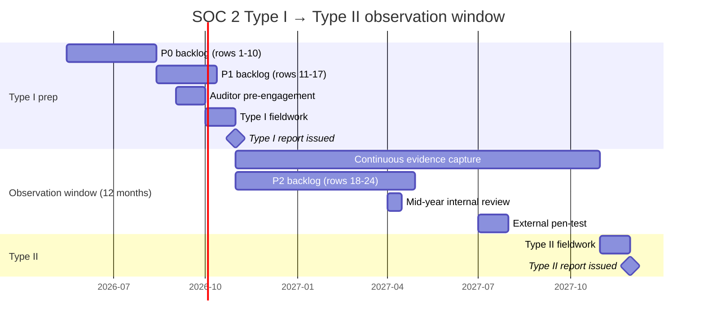

# SOC 2 Type I → Type II — Gap analysis

Roadmap row 37 (`v2.0` / Compliance / "SOC 2 Type I → Type II"). This is the
control map and remediation backlog that gets HMS from "audit-ready in
principle" to "Type I attested" and then through the 12-month observation
window required for Type II.

> **Status — 2026-05-15.** Initial gap analysis pass. The control inventory
> below is grounded in a code-level audit (file paths in [Appendix A](#appendix-a-evidence-paths))
> — not aspirational. Companion machine-readable matrix:
> [`docs/compliance/soc2-controls.csv`](./soc2-controls.csv). Roadmap row 37
> flipped `not-started` → `started`. The remediation backlog
> ([§ 5](#5-remediation-backlog)) is the working list; subsequent PRs will close
> items and tick this doc.

## 1 · Why now

A SOC 2 Type II report becomes a sales requirement once HMS targets:

- Hospital chains (organizational SOC 2 expectations from procurement)
- Foreign-private and military hospitals (often required by contract)
- Regional health authorities tendering for ECOWAS-wide platforms
- Any partner integration that crosses organizational trust boundaries
  (HIE handshakes, payer integrations, lab partner write-back)

Type I attests that controls **exist on a date**. Type II attests they
**operated effectively over a 6–12 month observation window**. The latter
gates real customer wins; the former is a checkpoint on the way.

The 12-month observation window is the load-bearing dependency: every
month we delay the Type I cutover delays Type II by an equal month.

## 2 · Scope

**System boundary.** The HMS production system as defined by:

- `hospital-core` (Spring Boot 3.4 backend, Java 21, Hibernate 6.6) — the
  PHI-handling system of record
- `hospital-portal` (Angular 20 web UI) — staff and patient web frontend
- `patient-android-app` and `patient-ios-app` — patient mobile clients
- `keycloak/` — identity provider (currently OIDC, Phase C cutover pending)
- Railway-hosted PostgreSQL (managed) — primary datastore
- Splunk Cloud (HEC ingest) — centralised log + audit aggregation
- Grafana Cloud (OTel ingest) — metrics + traces
- Twilio + Gmail SMTP — patient communication
- GitHub + GitHub Actions — source control + CI/CD

**Out of scope (for the first attestation).**

- Patient-self-service portals on tenant-owned infrastructure
  (each tenant inherits their own posture)
- HIE / lab partner systems we send to — boundary is at the egress
  (HL7 MLLP listener, FHIR endpoint)
- Customer hospital workstations and on-site networks

**Trust services criteria selected.**

| TSC | Included? | Rationale |
|---|---|---|
| **Security** (CC1–CC9) | ✅ Mandatory | The five common-criteria categories are required for every SOC 2 |
| **Availability** (A) | ✅ Included | Clinical operations cannot tolerate prolonged downtime; hospitals will demand uptime commitments |
| **Confidentiality** (C) | ✅ Included | PHI is the highest-sensitivity data class we handle |
| **Processing Integrity** (PI) | ⏳ Defer to Type II refresh | Adds significant audit cost; not currently required by named prospects |
| **Privacy** (P) | ⏳ Defer to Type II refresh | Burkina Faso 2021 data law gives us the substrate; formal Privacy TSC adds AICPA-specific notice/choice/consent disclosures we will layer in later |

## 3 · Control inventory

Status legend:

- ✅ **Present** — control implemented, evidence in repo, ready for auditor walkthrough
- 🟡 **Partial** — control exists in some form but documentation, automation, or evidence trail needs work before audit
- ❌ **Gap** — no control or controls exist only ad-hoc

### CC1 · Control environment

| Ref | Criterion | Status | Evidence / gap |
|---|---|---|---|
| CC1.1 | Demonstrates commitment to integrity and ethical values | ❌ Gap | No code of conduct in repo. **Action:** add `docs/compliance/policies/code-of-conduct.md` |
| CC1.2 | Board exercises oversight | ❌ Gap | No documented governance forum or board minutes. **Action:** define `docs/compliance/governance.md` (charter, cadence, decision log) |
| CC1.3 | Establishes structures, reporting lines, authorities, responsibilities | 🟡 Partial | `.github/CODEOWNERS` defines code-level ownership; org chart absent. **Action:** add `docs/compliance/org-structure.md` |
| CC1.4 | Demonstrates commitment to competence | ❌ Gap | No training records, no role-skills matrix. **Action:** track in HRIS, link from governance doc |
| CC1.5 | Enforces accountability | 🟡 Partial | Audit log captures privileged actions (`AuditEventLog`, 60+ event types) — accountability exists at the system layer but no documented disciplinary process |

### CC2 · Communication and information

| Ref | Criterion | Status | Evidence / gap |
|---|---|---|---|
| CC2.1 | Obtains or generates relevant quality information | ✅ Present | Splunk HEC + Grafana Cloud + audit log table (`support.audit_event_logs`) — fully wired |
| CC2.2 | Internally communicates information | 🟡 Partial | Runbooks exist (`docs/runbooks/`); no centralised security-communications channel documented |
| CC2.3 | Communicates with external parties | ❌ Gap | No public security contact, no `security.txt`, no vulnerability disclosure policy. **Action:** add `.well-known/security.txt` + `docs/compliance/policies/vulnerability-disclosure.md` |

### CC3 · Risk assessment

| Ref | Criterion | Status | Evidence / gap |
|---|---|---|---|
| CC3.1 | Specifies suitable objectives | 🟡 Partial | Roadmap defines product objectives; no risk-aligned objectives stated |
| CC3.2 | Identifies and analyzes risk | 🟡 Partial | `docs/security-hardening-plan.md` § "Risks & Mitigations" identifies 6 technical risks; no organisational risk register. **Action:** create `docs/compliance/risk-register.md` |
| CC3.3 | Assesses fraud risk | ❌ Gap | No fraud-risk assessment recorded. **Action:** add to risk register |
| CC3.4 | Identifies and assesses changes | 🟡 Partial | Change-management gates (PR review, CI) catch technical changes; no documented re-assessment cadence for organisational changes |

### CC4 · Monitoring activities

| Ref | Criterion | Status | Evidence / gap |
|---|---|---|---|
| CC4.1 | Conducts ongoing and/or separate evaluations | 🟡 Partial | Sonar + CodeQL + Dependency-Check run on every PR; no scheduled internal audit cycle |
| CC4.2 | Communicates internal control deficiencies | ❌ Gap | No issue-tracker convention for control deficiencies; no quarterly control review meeting documented. **Action:** add control-review log to `docs/compliance/` |

### CC5 · Control activities

| Ref | Criterion | Status | Evidence / gap |
|---|---|---|---|
| CC5.1 | Selects and develops control activities | ✅ Present | This document is the explicit selection. CC6–CC9 below are the development. |
| CC5.2 | Selects and develops general controls over technology | ✅ Present | `SecurityConfig.java`, `JwtAuthenticationFilter`, `KeycloakHospitalContextFilter`, `EncryptedStringConverter`, audit infrastructure, CI gates — all fall under this |
| CC5.3 | Deploys through policies and procedures | 🟡 Partial | Procedures (runbooks) are strong; policies (code of conduct, security policy) are absent — see CC1 |

### CC6 · Logical and physical access controls

| Ref | Criterion | Status | Evidence / gap |
|---|---|---|---|
| CC6.1 | Implements logical access security software | ✅ Present | Spring Security, JWT (HMAC + RS256), OIDC via Keycloak — see [`SecurityConfig.java`](../../hospital-core/src/main/java/com/example/hms/config/SecurityConfig.java), [`JwtAuthenticationFilter.java`](../../hospital-core/src/main/java/com/example/hms/security/JwtAuthenticationFilter.java), [`KeycloakHospitalContextFilter.java`](../../hospital-core/src/main/java/com/example/hms/security/oidc/KeycloakHospitalContextFilter.java) |
| CC6.2 | Restricts access to authorized users (provisioning) | ✅ Present | Role-assignment workflow ([`UserController`](../../hospital-core/src/main/java/com/example/hms/controller/UserController.java) + [`UserRoleHospitalAssignment`](../../hospital-core/src/main/java/com/example/hms/model/UserRoleHospitalAssignment.java)); Keycloak migration paths in [`scripts/keycloak-migration/`](../../scripts/keycloak-migration/) |
| CC6.3 | Authorizes, modifies, removes access | 🟡 Partial | Add/modify covered. **Gap:** no quarterly access-review process, no automated dormant-account deactivation. **Action:** quarterly access review job + report |
| CC6.4 | Restricts physical access | ✅ Present (vendor-delegated) | Railway + Splunk + Grafana data centres carry their own SOC 2 attestations — collect SubService Organisation Reports as part of vendor file (CC9.2) |
| CC6.5 | Discontinues physical/logical protections of disposed assets | 🟡 Partial | Tenant lifecycle columns (`Hospital.lifecycleState`, `purgeScheduledFor`) support purge state machine; no automated purge job runs. **Action:** scheduled purge worker + audit |
| CC6.6 | Implements perimeter logical access | ✅ Present | TLS enforced, HSTS, CORS allow-list, CSP, security headers — see `SecurityConfig.java` |
| CC6.7 | Restricts the transmission, movement, and removal of information | ✅ Present | TLS in transit; AES-256-GCM at rest on 15 PHI columns via [`EncryptedStringConverter.java`](../../hospital-core/src/main/java/com/example/hms/security/EncryptedStringConverter.java); cross-tenant reads gated + audited via [`CrossTenantReadAudit.java`](../../hospital-core/src/main/java/com/example/hms/security/audit/CrossTenantReadAudit.java) |
| CC6.8 | Implements controls to prevent / detect unauthorized software | 🟡 Partial | Container image build pinned in `Dockerfile`; CodeQL detects code-level injection; no host-IDS / runtime malware detection on Railway containers (vendor-delegated) |

### CC7 · System operations

| Ref | Criterion | Status | Evidence / gap |
|---|---|---|---|
| CC7.1 | Detects and monitors changes to configurations and to vulnerabilities | 🟡 Partial | Liquibase changelog discipline + GitHub Actions provide config integrity; Dependency-Check + Dependabot detect CVEs; **Gap:** no documented patching SLA. **Action:** `docs/compliance/policies/vulnerability-response.md` (Critical 24 h / High 7 d / Medium 30 d) |
| CC7.2 | Monitors components and operation for anomalies | 🟡 Partial | Grafana SLO dashboards + Splunk HEC logging; alert rules exist but routing not versioned in repo. **Action:** export Grafana alert + contact-point YAML to `grafana/provisioning/alerting/` |
| CC7.3 | Evaluates security events and incidents | 🟡 Partial | Audit infrastructure captures the events; no documented severity classification (P0/P1/P2/P3) or evaluation cadence. **Action:** `docs/compliance/policies/incident-response-policy.md` |
| CC7.4 | Responds to identified security incidents | 🟡 Partial | DR runbook ([`disaster-recovery.md`](../runbooks/disaster-recovery.md)) handles availability incidents; security-incident playbook (containment, evidence preservation, notification) absent |
| CC7.5 | Recovers from security incidents | ✅ Present | DR runbook §3–7 covers recovery; Postgres PITR + service redeploy + key-rotation procedures all documented |

### CC8 · Change management

| Ref | Criterion | Status | Evidence / gap |
|---|---|---|---|
| CC8.1 | Authorizes, designs, develops, configures, documents, tests, approves, and implements changes | ✅ Present | GitHub PR workflow + branch protection + `.github/CODEOWNERS` + 8 GitHub Actions workflows (`backend-ci.yml`, `frontend-ci.yml`, `codeql.yml`, `project-quality.yml`, `deploy.yml`); JaCoCo 80 % gate; Liquibase versioned migrations; runbook discipline |

### CC9 · Risk mitigation

| Ref | Criterion | Status | Evidence / gap |
|---|---|---|---|
| CC9.1 | Identifies, selects, and develops risk mitigation activities | 🟡 Partial | Per-control mitigations exist (encryption, MFA, audit, RBAC); no consolidated risk-mitigation tracking. **Action:** combine with risk register (CC3.2) |
| CC9.2 | Manages vendor and business-partner risks | ❌ Gap | 8 third-party vendors identified (Railway, Splunk, Grafana, Twilio, Gmail, GitHub, Keycloak self-host, Slack) — no central inventory, no DPA / BAA tracking, no SubService Organisation Report on file. **Action:** `docs/compliance/vendor-inventory.md` + DPA collection sprint |

### Availability (A1)

| Ref | Criterion | Status | Evidence / gap |
|---|---|---|---|
| A1.1 | Maintains, monitors, and evaluates performance | ✅ Present | Grafana SLO dashboards + Prometheus metrics + OTel traces |
| A1.2 | Authorizes, designs, develops, configures, documents, tests, approves, and implements environmental protections, software, data backup, and recovery | ✅ Present | DR runbook, RTO ≤ 30 min, RPO ≤ 24 h, hourly Postgres snapshots + WAL, Liquibase change log, key-rotation procedure |
| A1.3 | Tests recovery plan procedures | 🟡 Partial | DR drill checklist exists (every 6 months); no automated restore test in CI. **Action:** weekly restore-into-throwaway-env GitHub Action |

### Confidentiality (C1)

| Ref | Criterion | Status | Evidence / gap |
|---|---|---|---|
| C1.1 | Identifies and maintains confidential information | 🟡 Partial | 15 PHI columns inventoried via `@Convert(EncryptedStringConverter)` annotations; no consolidated PHI inventory document. **Action:** `docs/compliance/phi-inventory.md` (data-flow diagram + classification) |
| C1.2 | Disposes of confidential information | 🟡 Partial | Tenant lifecycle supports purge state; no automated purge job; no documented retention policy aligned to Burkina Faso 2021 data law. **Action:** retention policy + scheduled purge worker |

## 4 · Roll-up scorecard

| Category | Present | Partial | Gap | Notes |
|---|---:|---:|---:|---|
| CC1 — Control environment | 0 | 2 | 3 | Documentation-heavy; technical gaps minimal |
| CC2 — Communication & information | 1 | 1 | 1 | Add public security contact + comms procedure |
| CC3 — Risk assessment | 0 | 3 | 1 | Build risk register from existing fragments |
| CC4 — Monitoring activities | 0 | 1 | 1 | Schedule control reviews |
| CC5 — Control activities | 2 | 1 | 0 | Strong; depends on CC1 closure |
| CC6 — Logical & physical access | 5 | 3 | 0 | **Strongest area** — direct credit for engineering investment |
| CC7 — System operations | 1 | 4 | 0 | Documentation work, infra is in place |
| CC8 — Change management | 1 | 0 | 0 | Mature CI/CD + GitHub workflow |
| CC9 — Risk mitigation | 0 | 1 | 1 | Vendor management is the headline gap |
| A1 — Availability | 2 | 1 | 0 | Mature DR; automate the drill |
| C1 — Confidentiality | 0 | 2 | 0 | PHI inventory + retention policy |
| **Totals** | **12** | **19** | **7** | **38 control points; 31 % present, 50 % partial, 19 % gap** |

The roadmap's "~60 % of CC1–CC9" estimate is conservative. Counting partials at 0.5, the weighted CC1–CC9 coverage is **(8 + 0.5·15) / 30 ≈ 51 %** before CC9.2 vendor work, but the CC6 / CC7 / CC8 axis — the technically demanding part — is at **(8 + 0.5·8) / 17 ≈ 71 %**. The remaining work is overwhelmingly **documentation, policy, and process**, not engineering.

## 5 · Remediation backlog

Prioritised by what blocks Type I sign-off, then by what blocks the
12-month observation window starting cleanly. Companion machine-readable
matrix at [`soc2-controls.csv`](./soc2-controls.csv).

### P0 — must close before Type I auditor walkthrough

| # | Item | TSC ref | Owner | Effort |
|---|---|---|---|---|
| 1 | Code of conduct + security policy + acceptable-use policy (`docs/compliance/policies/`) | CC1.1, CC2.3, CC5.3 | Compliance | S |
| 2 | Risk register (`docs/compliance/risk-register.md`) seeded from `security-hardening-plan.md` § Risks | CC3.2, CC9.1 | Compliance + Backend | S |
| 3 | Vendor inventory + DPA collection (`docs/compliance/vendor-inventory.md`) | CC9.2 | Compliance | M |
| 4 | Vulnerability response policy with patching SLA (Critical 24 h / High 7 d / Medium 30 d) | CC7.1 | Backend | S |
| 5 | Incident response policy (severity matrix + escalation tree) | CC7.3, CC7.4 | Platform | S |
| 6 | Quarterly access review job + report | CC6.3 | Backend | M |
| 7 | Public security contact (`.well-known/security.txt`) + vuln-disclosure policy | CC2.3 | Platform | S |
| 8 | PHI inventory + data-flow diagram (`docs/compliance/phi-inventory.md`) | C1.1 | Backend | M |
| 9 | Data retention + purge policy (`docs/compliance/data-retention.md`) | C1.2, CC6.5 | Compliance + Backend | S |
| 10 | Governance charter (`docs/compliance/governance.md`) + decision-log convention | CC1.2, CC4.2 | Compliance | S |

### P1 — must close before observation-window day 1

| # | Item | TSC ref | Owner | Effort |
|---|---|---|---|---|
| 11 | Automated tenant purge worker (consumes `Hospital.purgeScheduledFor`) | CC6.5, C1.2 | Backend | M |
| 12 | Audit-log retention enforcement (Postgres-side time-bound purge in addition to Splunk) | CC7.2 | Backend | S |
| 13 | Grafana alert + contact-point YAML versioned in `grafana/provisioning/alerting/` | CC7.2 | Platform | S |
| 14 | Documented on-call rotation + escalation policy | CC7.4 | Platform | S |
| 15 | Weekly automated restore-test GitHub Action against throwaway env | A1.3 | Platform | M |
| 16 | Service-account key-rotation runbook (Twilio, Gmail, Splunk HEC, Keycloak client secret) | CC6.7 | Backend | S |
| 17 | Onboarding / offboarding checklist + permission-revocation playbook | CC6.3, CC1.5 | Compliance | S |

### P2 — close during the observation window (Type II preparation)

| # | Item | TSC ref | Owner | Effort |
|---|---|---|---|---|
| 18 | Per-field audit logging on PHI reads (today: bulk events only) | CC6.7, CC7.2 | Backend | M |
| 19 | Data Subject Access Request (DSAR) endpoint + workflow | C1.1, BF 2021 data law | Backend + Compliance | M |
| 20 | External pen-test (third-party assessor, scope = system boundary in § 2) | CC4.1 | Compliance + Platform | L |
| 21 | Multi-key encryption converter (zero-downtime key rotation) | CC6.7 | Backend | M |
| 22 | Concurrent-session limit enforcement | CC6.1 | Backend | S |
| 23 | Fraud-risk assessment cycle | CC3.3 | Compliance | S |
| 24 | Re-evaluate Privacy + Processing Integrity TSCs for inclusion | (Strategic) | Compliance | S |

## 6 · Observation-window timeline

Critical path: P0 closes by 2026-08-15 → P1 closes by 2026-10-15 →
auditor pre-engagement during October → Type I report by end of
2026-11. Observation window then runs 2026-11 → 2027-11; Type II
report issued early 2028. **Slippage on P0 is the single biggest schedule
risk.**

## 7 · Auditor evidence index

When the auditor walks the controls, this is what we hand them:

| Evidence | Source |
|---|---|
| Code of conduct, security policy, acceptable-use policy | `docs/compliance/policies/` (P0 item 1) |
| Risk register | `docs/compliance/risk-register.md` (P0 item 2) |
| Vendor inventory + DPAs | `docs/compliance/vendor-inventory.md` (P0 item 3) |
| Vulnerability response policy | `docs/compliance/policies/vulnerability-response.md` (P0 item 4) |
| Incident response policy | `docs/compliance/policies/incident-response-policy.md` (P0 item 5) |
| Access review reports | `docs/compliance/access-reviews/YYYY-Qn.md` (P0 item 6, recurring) |
| PHI inventory + data-flow diagram | `docs/compliance/phi-inventory.md` (P0 item 8) |
| Data retention policy | `docs/compliance/data-retention.md` (P0 item 9) |
| Governance charter | `docs/compliance/governance.md` (P0 item 10) |
| Audit log schema + sample queries | [`AuditEventLog.java`](../../hospital-core/src/main/java/com/example/hms/model/AuditEventLog.java), [`AuditEventType.java`](../../hospital-core/src/main/java/com/example/hms/enums/AuditEventType.java) |
| Encryption design | [`EncryptedStringConverter.java`](../../hospital-core/src/main/java/com/example/hms/security/EncryptedStringConverter.java), DR runbook § 7 |
| Auth flow design | [`docs/keycloak-implementation-gaps.md`](../keycloak-implementation-gaps.md), [`docs/security-hardening-plan.md`](../security-hardening-plan.md) |
| Cross-tenant audit | [`CrossTenantReadAudit.java`](../../hospital-core/src/main/java/com/example/hms/security/audit/CrossTenantReadAudit.java), [`docs/super-admin-cross-tenant-design.md`](../super-admin-cross-tenant-design.md) |
| DR runbook + drill log | [`docs/runbooks/disaster-recovery.md`](../runbooks/disaster-recovery.md), `docs/observability/dr-drill-log.md` |
| Change-management gates | `.github/workflows/`, branch-protection settings, `.github/CODEOWNERS` |
| Vendor SOC 2 reports | Railway, Splunk, Grafana, GitHub — collected under vendor inventory |

## Appendix A · Evidence paths

Code-level controls referenced in the inventory above:

- **Authentication & session.**
  [`SecurityConfig.java`](../../hospital-core/src/main/java/com/example/hms/config/SecurityConfig.java),
  [`JwtTokenProvider.java`](../../hospital-core/src/main/java/com/example/hms/security/JwtTokenProvider.java),
  [`JwtAuthenticationFilter.java`](../../hospital-core/src/main/java/com/example/hms/security/JwtAuthenticationFilter.java),
  [`KeycloakHospitalContextFilter.java`](../../hospital-core/src/main/java/com/example/hms/security/oidc/KeycloakHospitalContextFilter.java),
  [`KeycloakJwtAuthenticationConverter.java`](../../hospital-core/src/main/java/com/example/hms/security/oidc/KeycloakJwtAuthenticationConverter.java),
  [`TokenBlacklistService.java`](../../hospital-core/src/main/java/com/example/hms/security/TokenBlacklistService.java)
- **MFA.**
  [`MfaService.java`](../../hospital-core/src/main/java/com/example/hms/service/MfaService.java),
  [`UserMfaEnrollment.java`](../../hospital-core/src/main/java/com/example/hms/model/UserMfaEnrollment.java),
  [`MfaBackupCode.java`](../../hospital-core/src/main/java/com/example/hms/model/MfaBackupCode.java)
- **RBAC.**
  [`RoleValidator.java`](../../hospital-core/src/main/java/com/example/hms/security/RoleValidator.java),
  [`Role.java`](../../hospital-core/src/main/java/com/example/hms/enums/Role.java),
  [`UserRoleHospitalAssignment.java`](../../hospital-core/src/main/java/com/example/hms/model/UserRoleHospitalAssignment.java),
  [`PermissionMatrixSnapshot.java`](../../hospital-core/src/main/java/com/example/hms/model/PermissionMatrixSnapshot.java)
- **Encryption.**
  [`EncryptedStringConverter.java`](../../hospital-core/src/main/java/com/example/hms/security/EncryptedStringConverter.java),
  [`V53__encrypt_dispense_notes.sql`](../../hospital-core/src/main/resources/db/migration/V53__encrypt_dispense_notes.sql),
  [`V54__encrypt_prescription_phi.sql`](../../hospital-core/src/main/resources/db/migration/V54__encrypt_prescription_phi.sql),
  [`V55__encrypt_patient_phi.sql`](../../hospital-core/src/main/resources/db/migration/V55__encrypt_patient_phi.sql)
- **Audit.**
  [`AuditEventLog.java`](../../hospital-core/src/main/java/com/example/hms/model/AuditEventLog.java),
  [`AuditEventType.java`](../../hospital-core/src/main/java/com/example/hms/enums/AuditEventType.java),
  [`CrossTenantReadAudit.java`](../../hospital-core/src/main/java/com/example/hms/security/audit/CrossTenantReadAudit.java),
  [`PermissionMatrixAuditEvent.java`](../../hospital-core/src/main/java/com/example/hms/model/PermissionMatrixAuditEvent.java)
- **Logging.**
  [`SplunkHecAppender.java`](../../hospital-core/src/main/java/com/example/hms/logging/SplunkHecAppender.java),
  [`logback-spring.xml`](../../hospital-core/src/main/resources/logback-spring.xml)
- **Change management.**
  [`.github/workflows/`](../../.github/workflows/),
  [`build.gradle`](../../build.gradle) (JaCoCo gate),
  [`hospital-core/src/main/resources/db/migration/`](../../hospital-core/src/main/resources/db/migration/) (Liquibase)
- **DR & operations.**
  [`docs/runbooks/disaster-recovery.md`](../runbooks/disaster-recovery.md),
  [`docs/runbooks/grafana-observability.md`](../runbooks/grafana-observability.md),
  [`docs/runbooks/keycloak-cutover-runbook.md`](../runbooks/keycloak-cutover-runbook.md)

## Appendix B · References

- AICPA Trust Services Criteria (TSC 2017, revised 2022) — basis for CC1–CC9
  + Availability + Confidentiality categories used here
- Roadmap row 37 — `docs/roadmap.md` § 3.3 "Compliance pathway"
- Companion roadmap row 38 — HIPAA-equivalent posture (international customers)
- Companion roadmap row 39 — ECOWAS data-residency support
- `docs/security-hardening-plan.md` — the engineering-side security plan
  this gap analysis is grounded in
- `docs/keycloak-implementation-gaps.md` — auth-platform implementation status
- `docs/super-admin-cross-tenant-design.md` — privileged-access design
- Burkina Faso 2021 data-protection law — current legal basis for PHI
  handling; SOC 2 Privacy TSC inclusion will layer AICPA-specific
  notice/choice/consent requirements on top
