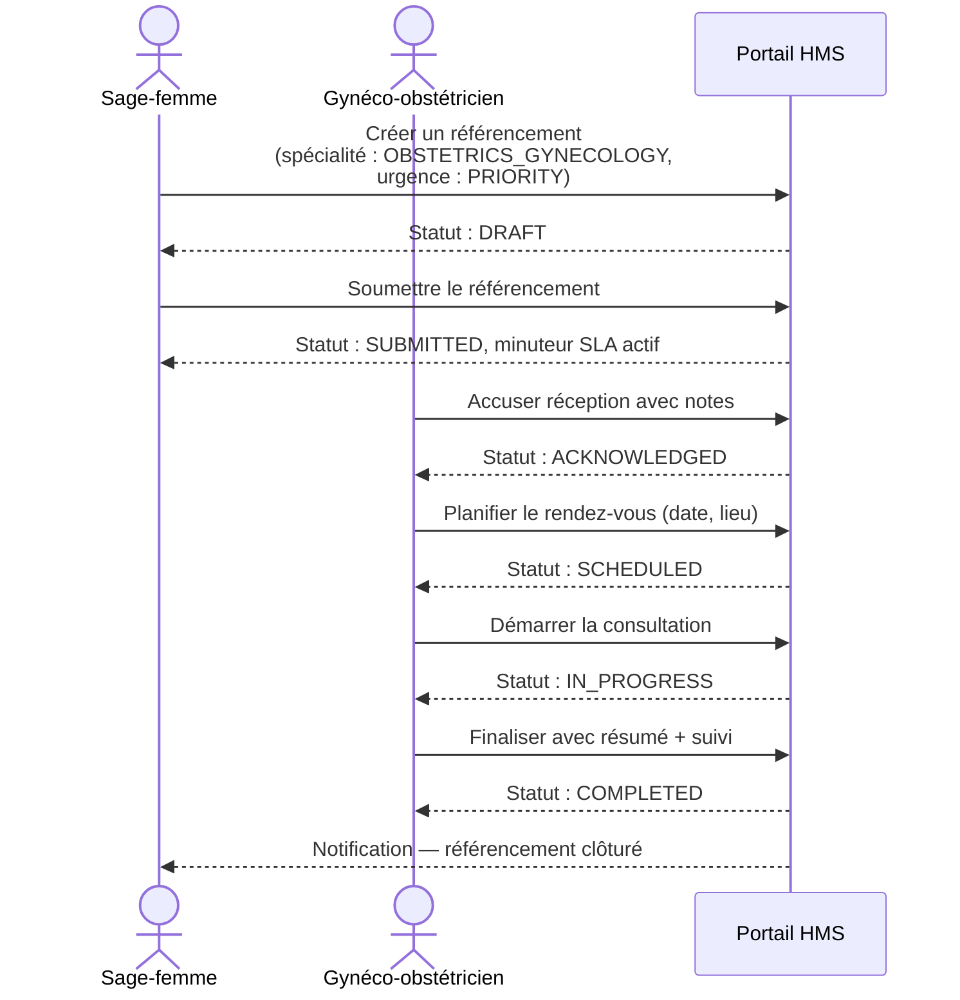
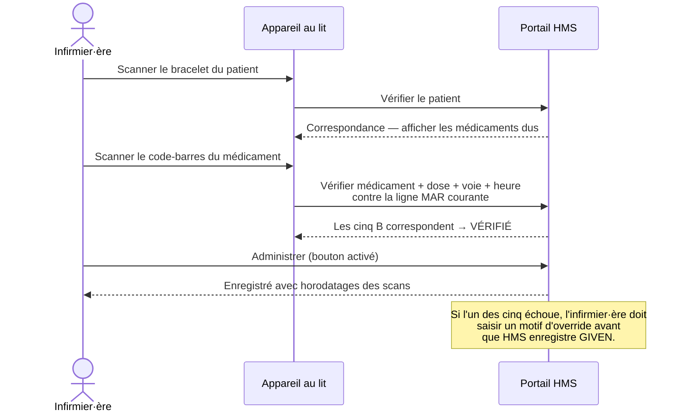

# HMS — Présentation aux parties prenantes

*Dernière mise à jour : 2026-05-01*
*Public visé : ministère de la Santé, direction hospitalière, bailleurs, partenaires d'intégration*
*English: [hms-stakeholder-overview.md](hms-stakeholder-overview.md)*

---

## 1. Qu'est-ce que HMS

HMS (Hospital Management System) est un dossier patient électronique **open-source, compatible OpenHIE, FHIR-natif et conçu mobile-first**, destiné aux déploiements ouest-africains. Ce n'est **pas** un clone d'Epic — il est conçu pour interopérer avec les systèmes déjà en usage dans la région (DHIS2 pour le reporting de santé publique, OpenMRS pour les sites communautaires, OpenHIE pour l'échange de données inter-établissements) plutôt qu'avec des réseaux propriétaires américains ou européens.

Chaque choix de conception reflète la réalité du terrain :

- **Connectivité intermittente** — chaque écran clinique gère explicitement les états de chargement, d'erreur et de vide ; le chat et la téléconsultation utilisent des médias à faible débit (photo ≤ 10 Mo, mémo vocal ≤ 5 Mo / 90 s)
- **Mobile-first** — les cliniciens utilisent téléphones et tablettes, pas des bureaux
- **Bilingue francophone + anglophone** — interface complète en français / anglais / espagnol
- **Paiement par mobile-money** — module de facturation aligné sur les rails de paiement ouest-africains
- **Terminologies ouvertes** — CIM-10, LOINC, RxNorm, ATC OMS (nous évitons délibérément SNOMED CT en raison du coût de licence dans les contextes à ressources limitées)
- **Analyseurs pertinents localement** — l'écouteur HL7 v2 MLLP prend en charge Mindray, Sysmex, Roche

---

## 2. Ce que HMS sait faire aujourd'hui

Ces fonctionnalités sont en production (`api.hms.bitnesttechs.com`) au mois de mai 2026.

### Garde-fous de sécurité clinique

- **Vérification des interactions médicamenteuses** — chaque prescription est confrontée à une liste sélectionnée de paires médicamenteuses (WHO Model Formulary / BNF / FDA) avant signature. Les interactions critiques bloquent l'ordonnance ; le clinicien doit explicitement passer outre avec un motif documenté.
- **Limites de dose pédiatrique** — les prescriptions pour les patients de moins de 18 ans sont vérifiées contre des plafonds en mg/kg propres à chaque médicament.
- **Prévention des doublons** — les ordonnances ou examens de laboratoire chevauchants sont signalés et exigent un override.
- **Alertes Best-Practice (BPA)** — au dossier du patient, trois cartes de protocole se déclenchent automatiquement :
  - **Protocole fièvre / paludisme** — température ≥ 38,5 °C sans antipaludique actif
  - **Protocole sepsis qSOFA** — FR ≥ 22 + PAS ≤ 100 + altération de la conscience
  - **Protocole hémorragie obstétricale** — patiente en post-partum avec FC > 100 ou PAS < 90
- **Cinq B au lit du patient (eMAR)** — le module eMAR utilise la caméra de l'appareil (ou un lecteur code-barres) pour vérifier *bon patient, bon médicament, bonne dose, bonne voie, bon moment* avant qu'une administration soit enregistrée. La fenêtre temporelle est de ± 60 minutes par rapport à l'horaire prévu.

### Coordination des soins

- **Bandeau Storyboard du patient** — en haut de chaque dossier : allergies, problèmes actifs, dernière consultation, statut de réanimation, directives anticipées. Une seule requête, plafonnée pour rester légère sur les liaisons facturées.
- **Visualiseur Chart Review à onglets** — consultations, notes, résultats de laboratoire, prescriptions, imagerie, procédures, plus une chronologie unifiée. Les chargements sont paginés en SQL (pas de tri en mémoire), donc l'écran reste rapide même sur des dossiers longs.
- **Order sets CPOE** — les administrateurs créent des paquets d'ordres réutilisables (par exemple « Admission pour pneumonie ») ; un clinicien en applique un à une admission et les prescriptions, examens et imagerie sont créés en une seule transaction. Chaque médicament passe quand même par le moteur de règles CDS.
- **Planification visuelle de cadence** — une grille calendaire pour la prise de rendez-vous ambulatoire, adaptée à un usage tablette à l'accueil.
- **Cycle de vie des références** — flux suivi de bout en bout depuis l'orientation par une sage-femme ou un généraliste, jusqu'à l'accusé de réception du spécialiste, la planification, le démarrage de la consultation, la finalisation ou le rejet. Chaque transition d'état est gardée côté serveur ; les sauts illégaux sont refusés.
- **Téléconsultation faible bande passante** — les cliniciens et patients échangent photos et mémos vocaux à l'intérieur du chat, conçu pour des données mobiles instables. Les médias sont validés côté serveur (taille, type, durée) ; pas de WebRTC vidéo requis.

### Confidentialité, consentement, audit

- **Consentement granulaire par domaine** — les patients peuvent autoriser le partage de domaines de données spécifiques (par exemple les analyses, mais pas l'historique de santé mentale). Les domaines sensibles (santé mentale, statut VIH, usage de substances, génétique) sont en niveau renforcé et exigent une réautorisation explicite.
- **Bris de glace avec audit** — les cliniciens peuvent passer outre le consentement dans des urgences déclarées ; les sessions sont bornées dans le temps (plancher 15 min, plafond 4 h), chaque lecture est comptée, l'administration de l'hôpital reçoit une liste auditable.
- **Piste d'audit pour acteurs système** — quand un analyseur ou un système HL7 écrit un résultat de laboratoire sans auteur humain, le journal d'audit enregistre l'étiquette de la machine source pour préserver la traçabilité.
- **Caviardage des PHI dans les journaux** — les identifiants patient, les notes en texte libre et les contenus de messages ne sont jamais journalisés en niveau INFO ; des classes de caviardage l'imposent aux frontières du framework.

### Interopérabilité

- **API FHIR R4 en lecture** — `/api/fhir/*` expose Patient, Encounter, Observation, Condition, MedicationStatement, AllergyIntolerance via HAPI FHIR 7.4. Conforme au contrat OpenHIE de dossier de santé partagé.
- **Écouteur HL7 v2 MLLP** — écouteur TCP (désactivé par défaut) acceptant les résultats de laboratoire ORU^R01 et la démographie ADT^A0x depuis les analyseurs et systèmes externes. Filtré par application et établissement émetteurs.
- **CDS Hooks 1.0** — `/api/cds-services` publie trois services : `hms-medication-allergy-check`, `hms-order-sign-rules`, `hms-bpa-protocols`. Des DPI tiers peuvent s'y abonner.
- **SMART-on-FHIR App Launch 1.0** — lancements patient et autonome ; OAuth2 PKCE ; portées standard. Les applications cliniques embarquées fonctionnent.
- **Export DHIS2 ADX** — comptes mensuels d'immunisations agrégés (codés CVX, sans PHI) poussés vers un nœud DHIS2 configuré. Mappings éditables par les administrateurs. La boîte d'envoi est idempotente — les renvois ne dupliquent pas. Les secrets d'authentification sont résolus depuis des variables d'environnement, pas depuis la base.

### Terminologies

- LOINC pour les examens de laboratoire
- CIM-10 / CIM-11 pour les diagnostics
- RxNorm + ATC OMS pour les médicaments
- Tous les champs valident leurs codes contre des motifs canoniques à la saisie ; les ressources FHIR émettent les URIs de système canoniques.

---

## 3. Architecture en un coup d'œil

```mermaid
flowchart LR
    subgraph Devices["Postes & terminaux"]
        Phone[Clinicien mobile<br/>EN / FR / ES]
        Tablet[Accueil / cadence<br/>tablette]
        Bedside[eMAR au lit<br/>scan code-barres]
    end

    subgraph HMS_Platform["Plateforme HMS"]
        FE[Hospital Portal<br/>Angular 20]
        BE[Hospital Core API<br/>Spring Boot 3.4 / Java 21]
        DB[(PostgreSQL)]
        Cache[(Redis)]
    end

    subgraph Standards["Adaptateurs aux normes"]
        FHIR[FHIR R4<br/>HAPI 7.4]
        MLLP[HL7 v2 MLLP<br/>écouteur TCP]
        CDS[CDS Hooks 1.0]
        SMART[SMART-on-FHIR<br/>App Launch 1.0]
        ADX[DHIS2 ADX<br/>planificateur]
    end

    subgraph External["Systèmes externes"]
        Analyzers[Analyseurs Mindray /<br/>Sysmex / Roche]
        DHIS2[DHIS2 Tracker<br/>registre santé publique]
        OpenHIE[Dossier santé partagé<br/>OpenHIE]
        OtherEHR[DPI tiers<br/>via CDS Hooks]
        SmartApps[Applis SMART<br/>embarquées]
    end

    Phone --> FE
    Tablet --> FE
    Bedside --> FE
    FE --> BE
    BE --> DB
    BE --> Cache
    BE --> FHIR
    BE --> MLLP
    BE --> CDS
    BE --> SMART
    BE --> ADX

    Analyzers -.HL7 v2.-> MLLP
    FHIR -.FHIR R4.-> OpenHIE
    CDS -.CDS Hooks.-> OtherEHR
    SMART -.OAuth2 PKCE.-> SmartApps
    ADX -.ADX 1.0.-> DHIS2
```

---

## 4. Trois parcours cliniques

### 4.1 Consultation ambulatoire — patient adulte avec douleur thoracique

```mermaid
sequenceDiagram
    actor Médecin
    participant HMS as Portail HMS
    participant CDS as Moteur CDS

    Médecin->>HMS: Ouvrir le dossier patient
    HMS-->>Médecin: Bandeau Storyboard<br/>(allergies, problèmes actifs, statut de réa)
    HMS-->>Médecin: Panneau BPA (rien à signaler — patient apyrétique)
    Médecin->>HMS: Prescrire ECG + troponine + aspirine 300 mg
    HMS->>CDS: Vérification à la signature
    CDS-->>HMS: Pas d'allergie, pas de doublon, dose correcte
    HMS-->>Médecin: Ordonnances signées ; demandes de labo imprimées
    Médecin->>HMS: Rédiger une note avec un code CIM-10
    HMS-->>Médecin: Code CIM-10 validé contre la liste canonique
```

### 4.2 Référencement prénatal — sage-femme vers gynécologue-obstétricien



Les gardes d'état sont appliquées côté serveur : un clinicien ne peut pas passer directement de DRAFT à COMPLETED ; l'entité refuse la transition.

### 4.3 Administration médicamenteuse au lit — eMAR cinq B



La vérification est rejouée au moment de l'administration pour que le contrôle **bon moment** utilise l'instant réel de l'administration, pas celui du premier scan.

---

## 5. Posture sécurité & conformité

| Domaine | Posture |
|---|---|
| **PHI dans les journaux** | Jamais en INFO. Identifiants patient, contenu des notes et messages chat sont caviardés à la frontière du framework. |
| **Authentification** | Keycloak OIDC ; SMART-on-FHIR pour les applications embarquées. |
| **Autorisation** | Hiérarchie de 20 rôles (super-admin → admin hôpital → rôles cliniques / labo / pharmacie / facturation). Chaque endpoint déclare sa garde de rôle. La portée hôpital est imposée — un admin d'hôpital ne voit que les données de son hôpital. |
| **Consentement** | Par domaine (22 domaines de données, 4 sensibles). La résolution du consentement est consciente de la portée ; les overrides bris-de-glace sont bornés dans le temps et audités individuellement. |
| **Audit** | Chaque accord de consentement, déclaration et utilisation de bris-de-glace, et écriture pilotée par machine est enregistré avec acteur, hôpital, patient et horodatage. |
| **Terminologies** | Validation côté serveur des motifs LOINC / CIM-10 / RxNorm / ATC ; les ressources FHIR émettent les URIs canoniques ; SNOMED CT volontairement évité (coût de licence). |
| **Migrations** | Liquibase additif uniquement ; une migration par release ; vérifié en CI par `LiquibaseSchemaIT` (Postgres 16 dans Testcontainers). |
| **Gates CI** | Backend unitaire + intégration ; frontend lint + Karma + Playwright ; SonarCloud quality gate ; CodeQL ; tests de prompts d'agents. Chaque PR les exécute ; les merges admin requièrent une autorisation explicite. |

---

## 6. Où il tourne

| Environnement | URL | Rôle |
|---|---|---|
| **Dev** | `api.hms.dev.bitnesttechs.com` | Déploiement continu depuis la branche `develop` ; tests d'ingénierie |
| **UAT** | `api.hms.uat.bitnesttechs.com` | Validation pré-production, tests d'intégration partenaires |
| **Production** | `api.hms.bitnesttechs.com` | Usage clinique en réel |

Les trois environnements sont fronts par Railway, utilisent PostgreSQL 16 managé, et appliquent les migrations Liquibase au démarrage. Chacun a sa propre configuration de point d'accès DHIS2 (la production pointe sur l'instance nationale en réel ; dev/uat pointent sur un sandbox).

---

## 7. Et après (éléments différés)

Les fonctionnalités ci-dessous sont cadrées, revues en design et volontairement repoussées au-delà de la coupe de mai 2026. Aucune ne bloque l'usage clinique courant.

| Item | Statut | Pourquoi différé |
|---|---|---|
| **Planificateur d'expiration des références** | Tier C de P1 #12 | Le traitement manuel suffit au volume actuel ; à revisiter quand le volume croîtra |
| **Entité piste d'audit des références** | Tier B de P1 #12 | Les gardes d'état empêchent déjà les transitions illégales ; une table d'historique explicite ajoute de la valeur quand un rapport en aval en aura besoin |
| **UI admin allowlist MLLP** | Backend complet (P1 #2b) ; frontend différé | Un seul analyseur intégré à ce jour ; UI qui vaut la peine d'être construite à 3+ |
| **API FHIR en écriture pour les Encounter** | Décision P1 #2b | Les Encounter en lecture seule suffisent à l'échange OpenHIE actuel ; API en écriture quand un partenaire le demandera |
| **Sémantique force-override des BPA** | Note P1 #3b | Les BPA sont consultatives par conception ; force-override différée tant qu'aucune institution ne demande des BPA bloquantes |
| **Modèles d'order sets pré-amorcés** | Note P1 #4 | L'authoring admin couvre la v0 ; les paquets pré-amorcés paludisme / sepsis / hémorragie obstétricale arriveront dans un follow-up |

Pour la profondeur d'ingénierie sur n'importe quel item P1, voir les documents par fonctionnalité dans ce dossier ([fhir.md](fhir.md), [hl7-mllp.md](hl7-mllp.md), [cds-hooks.md](cds-hooks.md), [smart-on-fhir.md](smart-on-fhir.md), [dhis2-adx.md](dhis2-adx.md), [pharmacy.md](pharmacy.md)).
