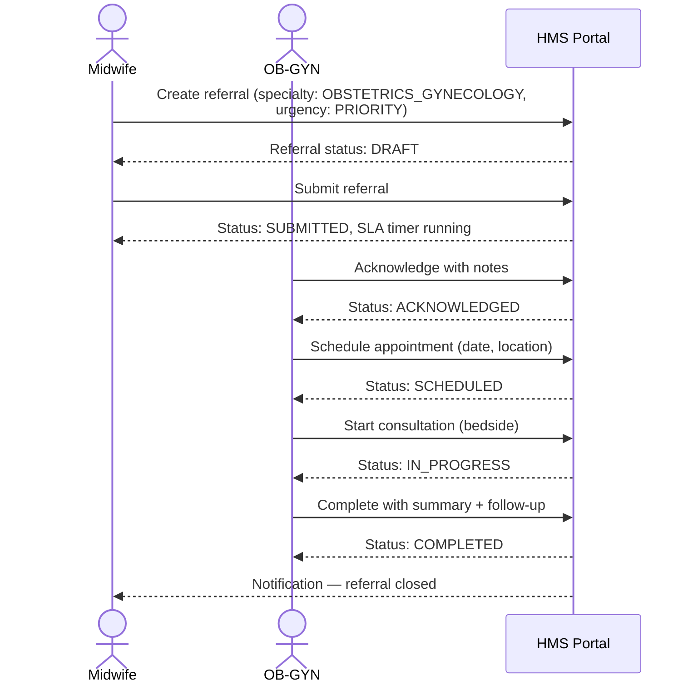
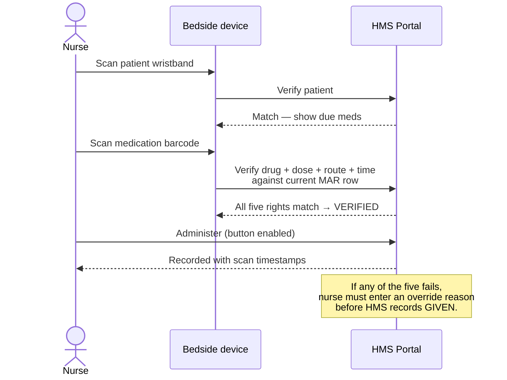

# HMS — Stakeholder Overview

*Last updated: 2026-05-01*
*Audience: ministry of health, hospital leadership, donors, integration partners*
*Français : [hms-stakeholder-overview.fr.md](hms-stakeholder-overview.fr.md)*

---

## 1. What HMS is

HMS (Hospital Management System) is an open-source, **OpenHIE-compatible, FHIR-native, mobile-first electronic health record** designed for West African deployments. It is explicitly **not** an Epic clone — it is built to interoperate with the systems already used in the region (DHIS2 for public-health reporting, OpenMRS for community sites, OpenHIE for cross-facility data exchange) rather than with proprietary US/EU networks.

Every design decision reflects the deployment reality:

- **Intermittent connectivity** — every clinical screen has loading / error / empty states; chat & telehealth use low-bandwidth media (≤10 MB photo, ≤5 MB / 90 s voice memo)
- **Mobile-first** — clinicians use phones and tablets, not desks
- **Bilingual francophone + anglophone** — full English / French / Spanish UI
- **Mobile-money payments** — billing module aligned with West African payment rails
- **Open terminologies** — ICD-10, LOINC, RxNorm, WHO ATC (we deliberately avoid SNOMED CT due to licensing cost in low-resource settings)
- **Locally-relevant analyzers** — HL7 v2 MLLP listener supports Mindray, Sysmex, Roche

---

## 2. What HMS can do today

These capabilities are live on production (`api.hms.bitnesttechs.com`) as of May 2026.

### Clinical safety guardrails

- **Drug interaction checks** — every prescription is screened against a curated WHO Model Formulary / BNF / FDA drug-pair list before signing. Critical interactions block the order; clinician must explicitly override with a documented reason.
- **Pediatric dose limits** — prescriptions for under-18 patients are checked against per-medication maximum mg/kg limits.
- **Duplicate-order prevention** — overlapping orders for the same medication or lab are flagged and require override.
- **Best-Practice Advisories (BPA)** — at the patient chart, three protocol cards trigger automatically:
  - **Malaria fever protocol** — temp ≥ 38.5°C with no active anti-malarial
  - **Sepsis qSOFA protocol** — RR ≥ 22 + sBP ≤ 100 + altered mental status
  - **OB hemorrhage protocol** — postpartum patient with HR > 100 or sBP < 90
- **Inpatient five-rights at the bedside** — the eMAR module uses the device camera (or barcode scanner) to verify *right patient, right drug, right dose, right route, right time* before any medication is recorded as given. Time window is ±60 minutes from the scheduled dose.

### Care coordination

- **Patient Storyboard banner** — at the top of every chart: allergies, active problems, latest encounter, code status, advance directives. One round-trip, capped to keep payloads small on metered links.
- **Chart Review tabbed viewer** — encounters, notes, lab results, prescriptions, imaging, procedures, plus a unified timeline. Loaders are paged in SQL (no in-memory limit), so it stays fast on long charts.
- **CPOE order sets** — admins author reusable order bundles (e.g. "Pneumonia admission"); a clinician applies one to an admission and prescriptions / lab orders / imaging requests are created in one transaction. Each medication still passes through the CDS rule engine.
- **Visual cadence scheduling** — a calendar grid for outpatient appointment booking, suitable for tablet use at reception.
- **Referral lifecycle** — full tracked workflow from a midwife or GP referring a patient out, through the receiving specialist's acknowledgement, scheduling, consultation start, completion, or rejection. Every state transition is guarded server-side; illegal jumps are refused.
- **Telehealth low-bandwidth** — clinicians and patients exchange photos and voice memos inside the chat, designed for unstable mobile data. Media is server-validated for size, type, and duration; no WebRTC video required.

### Privacy, consent, audit

- **Granular per-domain consent** — patients can authorise sharing of specific data domains (e.g. labs but not mental-health history). Sensitive domains (mental health, HIV status, substance use, genetics) are tier-elevated and require explicit re-authorisation.
- **Break-the-glass with audit** — clinicians can override consent in declared emergencies; sessions are time-bounded (15-min floor, 4-hour ceiling), every read is counted, hospital admin gets a reviewable audit list.
- **System-actor audit trail** — when an analyzer or HL7 system writes a lab result with no human author, the audit log records the source machine label so review remains traceable.
- **PHI redaction in logs** — patient identifiers, free-text notes, and message contents are never logged at INFO; redactor classes enforce this at framework boundaries.

### Interoperability

- **FHIR R4 read API** — `/api/fhir/*` exposes Patient, Encounter, Observation, Condition, MedicationStatement, AllergyIntolerance via HAPI FHIR 7.4. Conforms to the OpenHIE shared-health-record contract.
- **HL7 v2 MLLP listener** — TCP listener (off by default) accepts ORU^R01 lab results and ADT^A0x demographics from analyzers and external systems. Allowlisted by sending application + sending facility.
- **CDS Hooks 1.0** — `/api/cds-services` publishes three services: `hms-medication-allergy-check`, `hms-order-sign-rules`, `hms-bpa-protocols`. Third-party EHRs can subscribe.
- **SMART-on-FHIR App Launch 1.0** — patient and standalone launches; OAuth2 PKCE; standard scopes. Embedded clinical apps work.
- **DHIS2 ADX export** — monthly aggregated immunization counts (CVX-coded, no PHI) push to a configured DHIS2 node. Mappings are admin-editable. Outbox is idempotent — re-pushes don't duplicate. Auth secrets resolve from environment variables, not the database.

### Terminology

- LOINC for lab tests
- ICD-10 / ICD-11 for diagnoses
- RxNorm + WHO ATC for medications
- All form fields validate against canonical patterns at entry; FHIR resources emit canonical system URIs.

---

## 3. Architecture at a glance

```mermaid
flowchart LR
    subgraph Devices
        Phone[Mobile clinician<br/>EN / FR / ES]
        Tablet[Reception / cadence<br/>tablet]
        Bedside[Bedside eMAR<br/>barcode scan]
    end

    subgraph HMS_Platform["HMS platform"]
        FE[Hospital Portal<br/>Angular 20]
        BE[Hospital Core API<br/>Spring Boot 3.4 / Java 21]
        DB[(PostgreSQL)]
        Cache[(Redis)]
    end

    subgraph Standards["Standards adapters"]
        FHIR[FHIR R4<br/>HAPI 7.4]
        MLLP[HL7 v2 MLLP<br/>TCP listener]
        CDS[CDS Hooks 1.0]
        SMART[SMART-on-FHIR<br/>App Launch 1.0]
        ADX[DHIS2 ADX<br/>scheduler]
    end

    subgraph External["External systems"]
        Analyzers[Mindray / Sysmex / Roche<br/>analyzers]
        DHIS2[DHIS2 Tracker<br/>public-health registry]
        OpenHIE[OpenHIE shared<br/>health record]
        OtherEHR[Third-party EHRs<br/>via CDS Hooks]
        SmartApps[Embedded SMART<br/>clinical apps]
    end

    Phone --> FE
    Tablet --> FE
    Bedside --> FE
    FE --> BE
    BE --> DB
    BE --> Cache
    BE --> FHIR
    BE --> MLLP
    BE --> CDS
    BE --> SMART
    BE --> ADX

    Analyzers -.HL7 v2.-> MLLP
    FHIR -.FHIR R4.-> OpenHIE
    CDS -.CDS Hooks.-> OtherEHR
    SMART -.OAuth2 PKCE.-> SmartApps
    ADX -.ADX 1.0.-> DHIS2
```

---

## 4. Three clinical journeys

### 4.1 Outpatient consult — adult patient with chest pain

```mermaid
sequenceDiagram
    actor Doctor
    participant HMS as HMS Portal
    participant CDS as CDS engine

    Doctor->>HMS: Open patient chart
    HMS-->>Doctor: Storyboard banner<br/>(allergies, active problems, code status)
    HMS-->>Doctor: BPA panel (no triggers — patient is afebrile)
    Doctor->>HMS: Order ECG + troponin + aspirin 300 mg
    HMS->>CDS: Sign-time check
    CDS-->>HMS: Drug-allergy clear, no duplicate, dose OK
    HMS-->>Doctor: Orders signed; lab requisitions printed
    Doctor->>HMS: Write note with ICD-10 code
    HMS-->>Doctor: ICD-10 validated against canonical set
```

### 4.2 Antenatal referral — midwife to OB-GYN



State guards are enforced server-side: a clinician cannot skip from DRAFT directly to COMPLETED; the entity refuses the transition.

### 4.3 Inpatient bedside medication — eMAR five-rights



The verification re-runs at administer time so the **time** check uses the actual administration moment, not the moment the nurse first scanned.

---

## 5. Safety & compliance posture

| Domain | Posture |
|---|---|
| **PHI in logs** | Never at INFO. Patient identifiers, note contents, and chat messages are redacted at the framework boundary. |
| **Authentication** | Keycloak OIDC; SMART-on-FHIR for embedded apps. |
| **Authorisation** | 20-role hierarchy (super-admin → hospital admin → clinical / lab / pharmacy / billing roles). Every endpoint declares its role gate. Hospital scope enforced — a hospital admin sees only their hospital's data. |
| **Consent** | Per-domain (22 data domains, 4 sensitive). Consent resolution is scope-aware; break-the-glass overrides are time-bounded and individually audited. |
| **Audit** | Every consent grant, break-glass declare/consume, and machine-driven write is recorded with actor, hospital, patient, and timestamp. |
| **Terminology** | Server-side validation of LOINC / ICD-10 / RxNorm / ATC patterns; FHIR resources emit canonical system URIs; deliberate avoidance of SNOMED CT (license cost). |
| **Migrations** | Additive Liquibase only; one migration per release; verified in CI by `LiquibaseSchemaIT` (Postgres 16 in Testcontainers). |
| **CI gates** | Backend unit + integration; frontend lint + Karma + Playwright; SonarCloud quality gate; CodeQL; agent-prompt tests. Every PR runs all of them; admin merges only with explicit authorisation. |

---

## 6. Where it runs

| Environment | URL | Purpose |
|---|---|---|
| **Dev** | `api.hms.dev.bitnesttechs.com` | Continuous deploy from `develop` branch; engineering smoke tests |
| **UAT** | `api.hms.uat.bitnesttechs.com` | Pre-production validation, partner integration testing |
| **Production** | `api.hms.bitnesttechs.com` | Live clinical use |

All three environments are fronted by Railway, use managed PostgreSQL 16, and apply Liquibase migrations on boot. Each has its own DHIS2 endpoint configuration (production points at the live national instance; dev/uat point at sandbox).

---

## 7. What's next (deferred items)

The features below are scoped, design-reviewed, and intentionally pushed past the May 2026 cut. None are blockers for current clinical use.

| Item | Status | Why deferred |
|---|---|---|
| **Referral expiry scheduler** | Tier C of P1 #12 | Manual handling sufficient at current referral volume; revisit when volume grows |
| **Referral audit-trail entity** | Tier B of P1 #12 | State-machine guards already prevent illegal transitions; explicit history table adds value once a downstream report needs it |
| **MLLP allowlist admin UI** | Backend complete (P1 #2b); frontend deferred | Only one analyzer onboarded so far; UI worth building when there are 3+ |
| **Encounter-level FHIR write API** | P1 #2b decision | Read-only encounters are sufficient for current OpenHIE exchange; write API once partners ask |
| **BPA force-override semantics** | P1 #3b note | BPAs are advisory-only by design; force-override deferred until at least one institution requests blocking BPAs |
| **Pre-seeded order-set templates** | P1 #4 note | Admin authoring covers v0; pre-seeded malaria / sepsis / OB-hemorrhage bundles ship in a follow-up |

For engineering depth on any P1 item, see the per-feature docs in this folder ([fhir.md](fhir.md), [hl7-mllp.md](hl7-mllp.md), [cds-hooks.md](cds-hooks.md), [smart-on-fhir.md](smart-on-fhir.md), [dhis2-adx.md](dhis2-adx.md), [pharmacy.md](pharmacy.md)).
