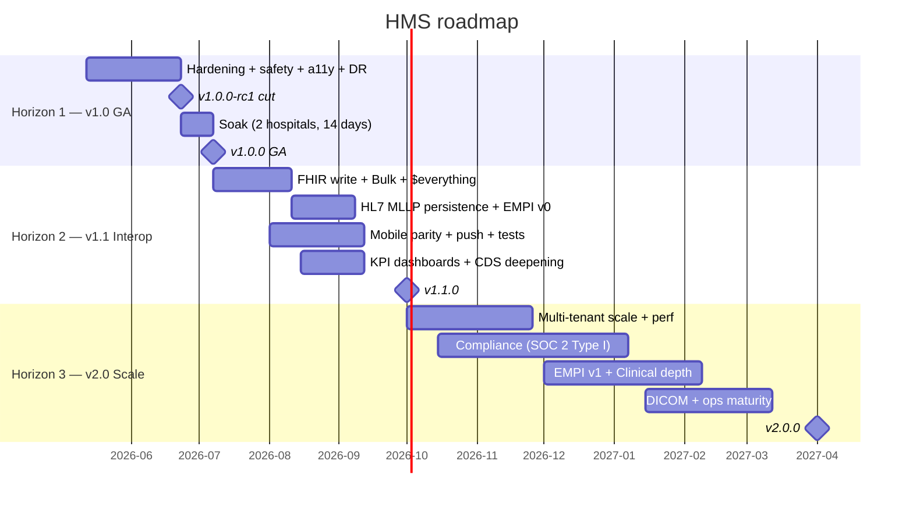

# HMS Roadmap

Canonical roadmap for the Hospital Management System project. Source of truth for
"what is shipped vs. planned vs. deferred". Two companion exports:

- [`roadmap.csv`](./roadmap.csv) — flat machine-readable, for Jira / Linear / Notion /
  Airtable / GitHub Projects import.
- [`roadmap.xlsx`](./roadmap.xlsx) — pre-formatted spreadsheet (bold + frozen header,
  auto-filter, color-coded horizons + statuses) for stakeholders who prefer Excel /
  Numbers / Sheets. Generated from the CSV; do not hand-edit — re-export instead.

Last updated: **2026-05-16**. Update both files together when scope moves.

> **2026-05-16 update (v2.0 foundation batch) — rows 25 + 36 + 39 +
> 41 + 42 flip to `started`.** Shipped on
> `feat/v2.0-foundation-batch`. Five v2.0-horizon rows that had been
> deferred in earlier batches for legitimate reasons: row 25
> oversized + cross-team, row 36 dependent on row 23 soak, row 39
> blocked on cloud-vendor decision, rows 41 + 42 large + Mixed.
> This pass lands the minimal foundation (flag-gated skeletons +
> empty contracts + named follow-ons) so the receptionist UI / Kafka
> producer / cloud routing / clinical UI work can be sequenced
> against stable interfaces.
>
> - **Row 25 (EMPI v0 — intra-tenant probabilistic match)** —
>   `app.empi.probabilistic.enabled` (default false). New
>   `EmpiProbabilisticMatcher.findCandidates(query)` returns an empty
>   list both flag-off **and** flag-on; the scorer body is
>   deliberately deferred. Reason: the deliverable target is "≥ 90 %
>   recall on labelled audit set" and shipping a scorer without the
>   audit set means tuning the threshold against intuition rather
>   than data — that's how false-positive merge incidents start.
>   `POST /api/empi/candidates` (`SUPER_ADMIN / HOSPITAL_ADMIN /
>   RECEPTIONIST / NURSE / DOCTOR`) returns 404 when off, the
>   matcher's empty list when on. 5 new tests (4 unit + 1 IT)
>   pinning the empty contract so a half-implementation cannot ship
>   silently. Runbook:
>   [`docs/runbooks/empi-probabilistic-matching.md`](./runbooks/empi-probabilistic-matching.md).
> - **Row 36 (Async dispense + lab via Kafka)** —
>   `app.async.pipeline.enabled` (default false) with
>   env-configurable `oruResultTopic` / `dispenseSettlementTopic` /
>   `consumerGroup`. **No `@KafkaListener` bodies, no producer-side
>   branches.** The actual fan-out lands once row 23 has soaked 14
>   days against real Mindray / Sysmex traffic — switching ORU
>   persistence to async before that soak entangles
>   analyzer-retransmit semantics with Kafka-consumer-retry
>   semantics for the eventual incident triage. Runbook:
>   [`docs/runbooks/async-kafka-pipeline.md`](./runbooks/async-kafka-pipeline.md).
> - **Row 39 (ECOWAS data-residency)** — decision-record doc
>   [`docs/compliance/ecowas-residency-decision-record.md`](./compliance/ecowas-residency-decision-record.md)
>   capturing per-country residency requirements (Senegal CDP, CI
>   ARTCI, Ghana DPC, BF CIL, Nigeria NDPR + framework for the rest),
>   plus the two viable cloud-procurement options (AWS `af-south-1`
>   managed services vs OVH Dakar bare-metal in-country) and the
>   decision-criteria matrix. **No code changes** — the existing V82
>   `Organization.region` column stays as the data plane the
>   eventual routing layer keys off. The decision blocker is owned
>   by Sales (which ECOWAS customer signs first + what their counsel
>   demands), not Engineering. The follow-on routing layer ships
>   only after that decision lands.
> - **Row 41 (OB/GYN + pediatrics finish)** — scope-audit doc
>   [`docs/runbooks/obgyn-pediatrics-finish-scope-audit.md`](./runbooks/obgyn-pediatrics-finish-scope-audit.md)
>   establishing that the three services already exist as
>   substantial implementations (~391 + ~422 + ~676 LOC); the
>   deliverable's "finish" language is misleading. What's actually
>   missing: cross-service workflow integration (3 new FKs), three
>   new clinical surfaces (antepartum/partogram, postpartum-hemorrhage
>   emergency, pediatric EPI scheduler), three frontend completion
>   gaps, PHI encryption audit on `NewbornAssessment`, cross-service
>   happy-path IT. **No service code changes** — each gap is sized
>   for its own foundation-pass PR. Nine follow-on PRs in total.
> - **Row 42 (DICOM proxy)** —
>   `app.imaging.dicom-proxy.enabled` (default false) with
>   `adapter=orthanc|dcm4chee` + env-configurable `baseUrl`.
>   `DicomProxyService.listInstancesForStudy(studyUid)` emits
>   `AuditEventType.IMAGING_RESULT_UPDATED` on every flag-on call so
>   the trail accumulates real-world usage data; the upstream HTTP
>   call (DICOMweb QIDO-RS / WADO-RS bridge) is the named follow-on.
>   `GET /api/imaging/dicom/{studyUid}/instances`
>   (`SUPER_ADMIN / HOSPITAL_ADMIN / DOCTOR / NURSE / RADIOLOGIST`)
>   returns 404 when off, empty list when on. **Why proxy at all**:
>   closes the audit / auth / tenant-isolation gaps in the existing
>   V75 `pacs_viewer_url_template` path where pixel-data access
>   bypasses HMS's surface. 5 new tests (4 unit + 1 IT). Runbook:
>   [`docs/runbooks/dicom-proxy.md`](./runbooks/dicom-proxy.md).

> **2026-05-16 update (row-20 follow-on) — Encounter + Observation
> FHIR write paths land.** Row 20 stays at `started`. Shipped on
> `feat/v1.1-fhir-write-encounter-observation`. Closes the named
> follow-on from the foundation-pass cell (which already promised
> "Encounter + Observation write paths deferred to the row-20
> follow-on (Observation's 1:N PatientVitalSign expansion needs a
> labresult-only carve-out)") and brings the row's three resources
> to a uniform PUT contract.
>
> - **`PUT /api/fhir/Encounter/{id}`** — `EncounterFhirWriteService`
>   applies a very narrow subset: `period.end → checkoutTimestamp`
>   (only when currently null — never overwrite an in-app checkout)
>   and `reasonCode[0].text → chiefComplaint` (only when currently
>   blank — never overwrite a clinician's triage note). Status,
>   class, type, subject, period.start, participants, diagnoses are
>   not honored — those state-machine transitions belong to the
>   clinical workflow. Tenant scope from
>   `HospitalContextHolder.getActiveHospitalId()` via
>   `EncounterRepository.findByIdAndHospital_Id`, with a
>   defence-in-depth hospital check on the loaded entity (mismatch
>   → 403). New `AuditEventType.ENCOUNTER_UPDATE` with
>   `entityType="ENCOUNTER"`. POST `/Encounter` is deliberately not
>   exposed (encounter provisioning has staff @ hospital +
>   assignment @ hospital + appointment-match invariants that the
>   FHIR sender cannot reliably satisfy).
> - **`PUT /api/fhir/Observation/labresult-{uuid}`** —
>   `ObservationFhirWriteService` honors `note[0].text` only,
>   appending with `" | "` separator if `lab_results.notes` already
>   contains text (duplicate inbound text is a no-op). Status,
>   value, code, subject, effective, category are not honored —
>   release / sign / acknowledge are actor-stamped state-machine
>   events. `PUT /Observation/vital-*` is rejected `422 BUSINESSRULE`
>   per the labresult-only carve-out (1:N `PatientVitalSign` →
>   Observation expansion has no single-row write target). Tenant
>   scope: lab result's `labOrder.hospital.id` must match the active
>   hospital (missing or mismatched → 403). Audit
>   `LAB_RESULT_UPDATED` with `entityType="LAB_RESULT"`.
> - **`HmsCapabilityStatementProvider`** extended to advertise the
>   `update` interaction on the `Encounter` and `Observation`
>   resource entries when `app.fhir.write.enabled=true`, and to
>   actively strip HAPI's auto-emitted `update` interaction when the
>   flag is off — so `/fhir/metadata` matches runtime behaviour for
>   both flag positions (mirrors the Patient pattern from the
>   foundation pass).
> - **Flag-first ordering** applied uniformly across all three
>   providers' write handlers. PR #343 Copilot review caught that
>   `PatientFhirResourceProvider.@Update` ran resource-shape
>   validation before the feature-flag short-circuit, returning 422
>   instead of 405 on flag-off + malformed body; the same gap on
>   `@Create` was explicitly named in the `fhir-r4-api` skill as
>   outstanding. Both Patient handlers are now corrected, and the
>   new `Encounter.@Update` + `Observation.@Update` handlers ship
>   with the corrective pattern from the start.
> - **8 new ITs.** `EncounterFhirWriteIT` (2 — flag-off PUT
>   rejection + flag-off metadata omits `update`),
>   `EncounterFhirWriteEnabledIT` (1 — flag-on metadata advertises
>   `update`), `ObservationFhirWriteIT` (3 — flag-off PUT against
>   `labresult-*` and `vital-*` both rejected + flag-off metadata
>   omits `update`), `ObservationFhirWriteEnabledIT` (2 — flag-on
>   metadata advertises `update` + flag-on `vital-*` rejection
>   reachable via 401-or-422). Same 401-or-handler-status
>   permissiveness as the existing Patient ITs; once an
>   authenticated TestRestTemplate is wired, the assertions tighten.
> - **Runbook**
>   [`docs/runbooks/fhir-write-api.md`](./runbooks/fhir-write-api.md)
>   updated with the Encounter + Observation honored-subset tables,
>   tenant gate description, audit emission, and the explicit
>   deferred-indefinitely stance on POST `/Encounter` + POST
>   `/Observation`. The row will move to `completed` once the
>   conformance soak against SMART App Launcher + Cerner + Epic
>   sandboxes is recorded.
>
> Rows 21 (`$export`) and 22 (`$everything`) remain `not-started` and
> are now unblocked by this follow-on — they can be picked next
> without leaving themselves dependency-bound.

> **2026-05-16 update (Keycloak cutover ops + per-tenant cost obs
> batch) — rows 8 + 18 + 19 + 44 flip to `started`.** Shipped on
> `chore/v1.0-keycloak-cutover-and-cost-obs`. All four rows had been
> deferred from earlier batches: rows 8 / 18 / 19 because the
> cutover sequence required real env-access decisions, and row 44
> because per-tenant labeling needed downstream context. This pass
> closes the documentation + scaffolding gap so the actual env
> operations (rows 8 / 18 / 19) and the chargeback rollout (row 44)
> can be executed against the existing runbooks.
>
> - **Row 18 (KC-4 uat migration)** + **Row 19 (KC-4 prod
>   migration)** + **Row 8 (Keycloak Phase C cutover)** — three
>   operational rows wrapped into a single conductor playbook
>   [`docs/runbooks/keycloak-cutover-sequence.md`](./runbooks/keycloak-cutover-sequence.md).
>   The conductor chains step 1 (row 18 uat migration) → 5-business-
>   day soak → step 2 (row 19 prod migration) → 24-hour observation
>   → step 3 (row 8 uat OIDC_REQUIRED=true flip) → 7-calendar-day
>   soak → step 4 (row 8 prod OIDC_REQUIRED=true flip) → 48-hour
>   smoke. Each step has a hard go/no-go gate and a rollback
>   decision tree. The existing component runbooks
>   ([`keycloak-migration-runbook.md`](./runbooks/keycloak-migration-runbook.md)
>   for rows 17 / 18 / 19 and
>   [`keycloak-cutover-runbook.md`](./runbooks/keycloak-cutover-runbook.md)
>   for row 8) remain the authoritative per-step procedure — the
>   conductor is the ordering + gating glue. New
>   `scripts/keycloak/preflight.sh` is the precondition harness that
>   wraps `env-sync-verify.sh --public-only` (R1-R4 + P1-P4 from
>   row 14) + OIDC discovery + issuer-match + optional A1-A3
>   (when `HMS_KC_ADMIN_TOKEN` is set) + optional backend health
>   (when `HMS_BACKEND_BASE_URL` is set). Exits non-zero on the
>   first failure; idempotent + safe to re-run. All three rows
>   stay `started` until the prod cutover smoke is green for 48 h
>   and the postmortem doc lands.
> - **Row 44 (Per-tenant cost observability)** — flag
>   `app.observability.tenant-cost.enabled` (default false). New
>   `ChargebackReportService.auditEventCountsPerTenant(from, to)`
>   delegates to the new
>   `AuditEventLogRepository.countByHospitalBetween` JPQL query
>   (groups by the denormalized `AuditEventLog.hospitalName` snapshot,
>   excludes rows without a snapshot — those belong to a future
>   platform-shared bucket). New `ChargebackReportController` exposes
>   `GET /api/super-admin/cost/per-tenant?from&to` with
>   `@PreAuthorize("hasRole('SUPER_ADMIN')")`, default trailing-30-day
>   window, 92-day cap; the controller returns 404 when the flag is
>   off so the endpoint shape stays hidden until the rollup is
>   operationally meaningful. **Splunk tenant labeling is already in
>   place** via the existing `AuditEventLog.hospitalName` snapshot
>   that flows through the SplunkHecAppender — no code change needed
>   for the foundation pass. Grafana per-tenant tagging at the
>   Micrometer level is the named follow-on (needs a
>   `MeterFilter` that reads `HospitalContextHolder` at sample time —
>   non-trivial because Micrometer's tag set is evaluated at meter
>   registration, not at sample time). 5 new tests:
>   `ChargebackReportServiceTest` (4 unit cases — flag passthrough +
>   Object[] row mapping + Integer-count boxing + empty-list) and
>   `ChargebackReportControllerIT` (1 IT — flag-off 401/404 split).
>   Runbook:
>   [`docs/runbooks/per-tenant-cost-observability.md`](./runbooks/per-tenant-cost-observability.md).
>   Follow-on: Splunk event-count input + Grafana series-cardinality
>   input + Postgres storage-bytes input + per-deployment currency
>   cost model + Control Tower panel.

> **2026-05-16 update (FHIR Interop completion batch) — rows 21
> ($export) + 22 ($everything) flip to `started`.** Shipped on
> `feat/v1.1-fhir-bulk-and-everything`. Both operations were blocked
> on the row-20 write API; that's now resolved on its own branch.
> The two operations are gated by independent flags so an operator
> can promote `$everything` (synchronous, low-risk) without also
> enabling `$export` (async, S3-bound, capacity-sensitive).
>
> - **Row 21 (FHIR Bulk Data Access $export)** —
>   `app.fhir.operations.bulk-export.enabled` (default false).
>   `FhirBulkExportOperationProvider` exposes `POST /api/fhir/$export`
>   (system level) and `POST /api/fhir/Patient/$export` (type level)
>   as HAPI plain-provider `@Operation` methods with
>   `manualResponse=true`; each accepted call returns
>   `202 Accepted` + `Content-Location: /api/fhir-bulk-status/{jobId}`.
>   `FhirBulkExportService` holds the job state in an in-memory
>   `ConcurrentHashMap` (the persistent `fhir_bulk_export_jobs` table
>   plus JPA repository land with the async runner follow-on); tenant
>   scope from `HospitalContextHolder.getActiveHospitalId()` pinned
>   at creation, cross-tenant status / cancel collapses to 404
>   (invisible rejection — no information leak). Honors `_since`
>   (ISO-8601) and `_type` (CSV). `FhirBulkExportStatusController`
>   at `/api/fhir-bulk-status/{jobId}` returns `202` + `Retry-After: 120`
>   on GET (foundation pass never advances jobs) and `202` on DELETE
>   drop, `404` on miss / cross-tenant. The poll path is HMS-specific
>   (sibling to HAPI's `/api/fhir/*` mount) because the FHIR servlet
>   captures the entire `/api/fhir/*` space; canonical
>   `$export-poll-status` mounting via a HAPI `manualResponse=true`
>   operation lands with the async runner. `AuditEventType.DATA_EXPORT`
>   emitted with `entityType="FHIR_BULK_EXPORT_JOB"` on kickoff +
>   cancel. Group-level `$export` deferred (needs
>   `GroupFhirResourceProvider`, not currently modelled). Runbook:
>   [`docs/fhir-bulk.md`](./fhir-bulk.md).
> - **Row 22 ($everything operation)** —
>   `app.fhir.operations.everything.enabled` (default false).
>   `@Operation(name="$everything", type=Patient.class)` on
>   `PatientFhirResourceProvider` delegates to
>   `PatientEverythingService.everythingForPatient(uuid)`. The
>   service assembles a single FHIR `Bundle` of type `searchset`
>   containing the Patient plus up to 200 most-recent Encounters,
>   200 vital-sign rows (each 1:N-expanded into Observation
>   resources by the existing mapper), 200 lab-result Observations,
>   all Conditions, and 200 MedicationRequests — every collection
>   hospital-scoped via the active context. Missing scope → 403;
>   cross-tenant patient → 404. `AuditEventType.PATIENT_EXPORT` with
>   entry-count description. Synchronous (no async runner needed for
>   single-patient compartments).
> - **`HmsCapabilityStatementProvider`** extended with
>   `applyOperationVisibility(cs)` that strips HAPI's auto-emitted
>   `rest[].operation` entry for `export` / `everything` when the
>   corresponding flag is off, so `/api/fhir/metadata` matches
>   runtime behaviour for both flag positions (same pattern as
>   row-20's `Patient.conditionalCreate` strip).
> - **4 new ITs.** `FhirBulkExportIT` (4 cases — kickoff system,
>   kickoff Patient, status endpoint, metadata-omit; all rejected
>   401/405 when flag off), `FhirBulkExportEnabledIT` (1 — flag-on metadata
>   advertises `export`), `PatientEverythingIT` (2 — flag-off PUT
>   rejection + metadata omits), `PatientEverythingEnabledIT` (1 —
>   flag-on metadata advertises `everything`). Authenticated
>   wire-level Bundle composition assertion deferred to the row-22
>   follow-on (today's 401-or-handler-status blocks the deeper
>   check).
> - **Named follow-on** (row stays `started` until):
>   for row 21 — persistent `fhir_bulk_export_jobs` table (V103),
>   `@Scheduled` (or Kafka once row 36 lands) NDJSON runner
>   streaming to an S3-compatible bucket, output-manifest 200
>   response, Group-level `$export`, canonical poll-URL mounting
>   under `/api/fhir/*`, spec-compliant 501-on-flag-off; for row
>   22 — authenticated end-to-end IT, `_since` / `_type` / page
>   cursor / start-end params honored, SMART App Launcher
>   conformance soak.

> **2026-05-16 update — daytime foundation passes flip rows 20, 27,
> 32, and 43 to `started`.** Four feature branches merged into
> develop and were promoted through UAT to main on 2026-05-16. Each
> follows the foundation-pass discipline (`not-started → started`,
> NOT `→ completed`); follow-on scope is explicitly named in each
> cell. The companion skills refresh shipped on
> [`3bf62b29`](https://github.com/DevFaso/hms/commit/3bf62b29) (PR
> #340); the roadmap-sync flipping each row to `started` shipped on
> [`401b7d36`](https://github.com/DevFaso/hms/commit/401b7d36) (PR
> #339). Subsequent code-level review findings raised by Copilot on
> each feature PR (path-scoped CORS for `/cds-services`, feature-flag
> short-circuit ordering in the FHIR provider, V101 `btrim(mrn) <> ''`,
> `entityType = "PATIENT"` in the FHIR audit emitter, `127.0.0.1:9115`
> for Blackbox, `management.endpoint.health.probes.enabled=true`,
> Grafana-provisioning alert mirror, `RoleValidator.requireActiveHospitalId()`
> on the KPI service) are tracked as **follow-on PRs against each
> row**; the skills update (PR #340) codifies the lessons so future
> branches don't repeat them.
>
> - **Row 20 (FHIR write API)** —
>   [`3f2b0c3d`](https://github.com/DevFaso/hms/commit/3f2b0c3d)
>   (PR #343 `feat/v1.1-fhir-write-api`). V101
>   adds the partial unique index
>   `uk_patient_hospital_registration_active_mrn` on
>   `(hospital_id, LOWER(mrn)) WHERE is_active = true` so FHIR
>   conditional-create multi-match (412) stays unreachable in
>   practice. `PatientFhirWriteService` ships PUT `/Patient/{id}`
>   updating the FHIR-mutable subset only
>   (address / telecom / active — identity columns flow through the
>   registration admin path) and POST `/Patient` with
>   `If-None-Exist` per the `empi-identity` policy (0 → 404, 1 →
>   200 with existing, >1 → 412, missing/non-MRN → 422 — never
>   auto-provisions). Gated by `app.fhir.write.enabled` (default
>   `false`); the `CapabilityStatement` advertises
>   `Patient.conditionalCreate=true` only when on. 6 IT cases across
>   `PatientFhirWriteIT` + `PatientFhirWriteEnabledIT`. Encounter +
>   Observation write paths deferred to the row-20 follow-on.
>   Runbook:
>   [`docs/runbooks/fhir-write-api.md`](./runbooks/fhir-write-api.md).
> - **Row 27 (CDS Hooks public discovery)** —
>   [`1a5cca78`](https://github.com/DevFaso/hms/commit/1a5cca78)
>   (PR #338 `feat/v1.1-cds-hooks-public-discovery`). `SecurityConfig`
>   adds an
>   explicit `app.cors.cds-hooks-sandbox.*` allowlist with sensible
>   defaults for the Cerner / Epic / SMART App Launcher sandbox
>   origins so partner UIs can probe HMS without wildcarding.
>   `PatientViewCdsService` and `BpaProtocolsCdsService` declare
>   prefetch templates so Cerner/Epic can pre-resolve the FHIR
>   queries inline. `CdsHooksDiscoveryIT` replaces the single-case
>   shape check with five spec-grounded assertions including a CORS
>   preflight from `https://launcher.smarthealthit.org`. Row stays
>   `started` until clean discovery + invocation pairs are recorded
>   against all three external sandboxes. Runbook:
>   [`docs/runbooks/cds-hooks-sandbox-validation.md`](./runbooks/cds-hooks-sandbox-validation.md).
> - **Row 32 (KPI dashboard service)** —
>   [`74abb291`](https://github.com/DevFaso/hms/commit/74abb291)
>   (PR #341 `feat/v1.1-kpi-dashboard-service`). New
>   `GET /api/kpi/dashboard?from&to` (180-day cap; `SUPER_ADMIN /
>   HOSPITAL_ADMIN / DOCTOR / NURSE / STAFF` access). The three KPIs
>   (door-to-doctor, dispense lead time, no-show rate) compute
>   on-demand via native SQL against `clinical.encounters`,
>   `clinical.dispenses ⋈ clinical.prescriptions`, and
>   `clinical.appointments` — tenant scope from
>   `HospitalContextHolder.getActiveHospitalId()` (super-admin
>   without an explicit pin returns an empty rollup). New
>   `<app-kpi-cards>` sub-component embedded inside `analytics/`
>   with `ANALYTICS.KPI.*` keys across en/fr/es. Materialized-view
>   backing deferred (premature given current query volume + H2 MV
>   gap); P50 median, sparkline, and seeded E2E axe-smoke follow-on.
>   Runbook:
>   [`docs/runbooks/kpi-dashboard.md`](./runbooks/kpi-dashboard.md).
> - **Row 43 (Synthetic monitoring)** —
>   [`638e8d72`](https://github.com/DevFaso/hms/commit/638e8d72)
>   (PR #342 `feat/v2.0-synthetic-monitoring`). Blackbox-exporter
>   added to
>   the existing `observability` docker-compose profile; four probe
>   modules in `grafana/blackbox.yml` + four scrape jobs in
>   `grafana/prometheus.yml` against the public Actuator / FHIR /
>   SMART config / CDS discovery surfaces; three alert rules in
>   `grafana/rules/alerts.yml` group `hms.synthetic`, including the
>   deliverable's `> 10% probe failure for 5 min` page. Multi-geo
>   rollout itself (Option A: 3 Blackbox regions; Option B: k6
>   cloud canary from 3 default load zones) is operational and
>   deferred to the row-43 follow-on. Runbook:
>   [`docs/runbooks/synthetic-monitoring.md`](./runbooks/synthetic-monitoring.md).

> **2026-05-16 update — overnight foundation passes for v1.1 + v2.0
> landed (4 PRs).** Four feature branches merged into develop in
> sequence; this narrative covers all four for context. Row 24's
> `not-started → started` flip rode along with its own feature PR
> ([`c07e439e`](https://github.com/DevFaso/hms/commit/c07e439e) on PR
> #332 — already merged into develop at the time of this sync). Rows
> 26, 35, and 38 are flipped to `started` in this batched
> roadmap-sync commit:
> - **Row 24 (ADT^A01/A04/A08 → Admission/Encounter sync)** —
>   [`988ef467`](https://github.com/DevFaso/hms/commit/988ef467)
>   (PR #332 `feat/v1.1-adt-admission-encounter-sync`). V99 migration
>   adds `external_visit_number` + `external_sending_application` +
>   `external_sending_facility` + `external_message_control_id`
>   (nullable) to `admissions` + `clinical.encounters` with partial
>   composite unique indexes scoped per `(sender, hospital)`.
>   `MllpInboundAdtVisitProjectionService` reconciles inbound A01/A04/A08
>   against existing rows by the HL7 visit-number triplet, `REQUIRES_NEW`
>   so projection failure cannot roll back the demographic write; gated
>   behind `app.hl7.adt.visit-sync.enabled` (default `false`).
>   Conflict-resolution rules + operator playbook in
>   [`docs/runbooks/hl7-adt-conflict-resolution.md`](./runbooks/hl7-adt-conflict-resolution.md).
>   Auto-create deferred to a follow-on PR (needs per-hospital
>   intake-provider config).
> - **Row 26 (CDS Hooks LOINC binding)** —
>   [`762cc981`](https://github.com/DevFaso/hms/commit/762cc981)
>   (PR #333 `feat/v1.1-cds-hooks-loinc-binding`). V100 migration
>   adds `loinc_code` + `loinc_display` (nullable) to
>   `clinical.patient_problems`. `ProblemLoincBindings` seed table
>   (13 entries spanning cardio / endocrine / respiratory / hematology /
>   malaria / HIV / TB / renal / OB — calibrated to the WHO-EMRO
>   chronic-care workload). `PatientViewCdsService.renderProblem` now
>   appends typed `[ICD-10: …]` and `[LOINC: …]` annotations on each
>   problem line; entity-explicit `loincCode` wins over the seed
>   fallback. Malformed codes drop silently.
> - **Row 35 (Read replicas + Hikari tuning)** —
>   [`dd193f80`](https://github.com/DevFaso/hms/commit/dd193f80)
>   (PR #334 `feat/v2.0-read-replicas-hikari`). Full Hikari tuning
>   surface env-overridable via `spring.datasource.hikari.*`;
>   `ReplicaDataSourceProperties` + `ReadWriteRoutingDataSource`
>   (`AbstractRoutingDataSource` keyed off Spring's
>   `isCurrentTransactionReadOnly()`); replica bean is
>   `@ConditionalOnProperty`-gated on
>   `app.datasource.replica.enabled`; `DataSourceConfig` composes
>   (write, optional replica) behind the routing wrapper. Flag-off
>   behaviour is bit-for-bit unchanged. Activation playbook +
>   5-business-day UAT soak procedure in
>   [`docs/runbooks/postgres-pool-replica-sizing.md`](./runbooks/postgres-pool-replica-sizing.md).
> - **Row 38 (HIPAA-equivalent posture)** —
>   [`d1419045`](https://github.com/DevFaso/hms/commit/d1419045)
>   (PR #335 `feat/v2.0-hipaa-posture`). Mirrors the SOC 2 row-37
>   pattern.
>   [`docs/compliance/hipaa-gap.md`](./compliance/hipaa-gap.md)
>   inventories 51 control points across §164 Security Rule
>   (administrative / physical / technical / organizational / docs) +
>   Privacy Rule (minimum necessary + individual rights) — scorecard
>   **19 present / 17 partial / 15 gap = 54 % weighted**;
>   technical-safeguards axis at **75 %** (§164.312(a)(2)(iv)
>   Encryption + Decryption rated `partial` — AES-256-GCM operational
>   on 14 narrative columns via `EncryptedStringConverter`, identifier
>   columns plaintext today). Companion machine-readable
>   [`hipaa-controls.csv`](./compliance/hipaa-controls.csv) +
>   [`hipaa-baa-template.md`](./compliance/hipaa-baa-template.md)
>   (11-section BAA draft with sub-BAA table for Railway / Splunk /
>   Grafana / Keycloak host / email + SMS vendors) +
>   [`phi-inventory.md`](./compliance/phi-inventory.md) (all 18
>   §164.514(b)(2) identifier categories + clinical-record body,
>   per-column encryption status, dataflow map). 27-item remediation
>   backlog (10 P0 / 10 P1 / 7 P2); P0 critical path 2026-09-30
>   calibrated to land one month after the SOC 2 P0 deadline.

> **2026-05-15 update — v1.1 / Interop HL7 / ORU^R01 → LabResult
> persistence shipped.** Row 23 flipped from `not-started` to
> `started` on `feat/v1.1-oru-r01-lab-persistence`. The core
> ingestion path (`MllpInboundLabServiceImpl` matching
> `LabSpecimen.accessionNumber` → `LabOrder` → `Encounter`, writing
> a `SYSTEM`-actor `LabResult` with cross-tenant guard) already
> existed; this PR adds the three production-readiness pieces the
> roadmap deliverable still needed: (1) MSH-10 idempotency via
> `V98__lab_result_source_message_control_id.sql` + a partial
> unique index, so analyzer retransmits on lost ACK collapse to a
> single row instead of duplicating the trend; (2)
> `IntegrationMessageRecorder` wiring on every dispatch path
> (RECEIVED / FAILED), so inbound traffic is visible in the DLQ /
> replay surface; (3) `AuditEventType.LAB_RESULT_UPDATED` emission
> on every accepted ingestion, with audit failures swallowed so
> they cannot roll back the clinical write. Plus the explicit
> roadmap deliverable —
> [`OruR01VendorSampleIngestionTest`](../hospital-core/src/test/java/com/example/hms/hl7/mllp/OruR01VendorSampleIngestionTest.java)
> exercises full dispatcher → service plumbing with realistic
> **Mindray BS-240** (LOINC `15074-8` glucose, abnormal `H`) and
> **Sysmex XN-1000** (three-OBX CBC panel, critical `LL`
> haemoglobin) sample messages transcribed from manufacturer
> integration guides, plus a same-MSH-10 retransmit-delegation
> case. Row stays `started` until follow-on multi-OBX persistence
> (CBC panels currently only persist first OBX) and a real-traffic
> soak against the first partner analyzer.
>
> **2026-05-15 update — v2.0 / Multi-tenancy / Schema-per-tenant
> migration path foundation pass started.** Row 33 flipped from
> `not-started` to `started` on `feat/v2.0-schema-per-tenant`. Foundation
> shipped: `TenantIsolationMode` enum (`ROW_LEVEL` default, `SCHEMA`),
> `Hospital.isolationMode` + `Hospital.tenantSchemaName` columns
> (Liquibase `V97__hospital_tenant_isolation_mode.sql` with CHECK
> constraints binding the two columns and a partial unique index on
> the schema name), and the application-side plumbing under
> `hospital-core/src/main/java/com/example/hms/security/tenant/schema/`
> — `SchemaTenantIdentifierResolver`, `SchemaTenantConnectionProvider`
> (strict identifier allow-list, `SET search_path` per tenant),
> `TenantSchemaLookup` (JDBC-only to avoid resolver recursion, 5-min
> cache with manual invalidate), and `SchemaTenancyConfiguration`
> (Hibernate `multiTenancy=SCHEMA` wired via
> `HibernatePropertiesCustomizer`). The whole path is gated by
> `app.tenancy.schema-isolation.enabled` (default `false`) so production
> behavior is bit-for-bit unchanged. 28 unit tests cover resolver,
> provider, and lookup. Operational procedure (provision schema, copy
> rows, flip mode, soak, rollback) documented in
> [`docs/runbooks/schema-per-tenant-migration.md`](./runbooks/schema-per-tenant-migration.md).
> Row stays `started` until `scripts/tenancy/provision-schema.sh`,
> `scripts/tenancy/copy-rows.sh`, the cache-invalidation REST endpoint,
> and the first end-to-end UAT cutover land in subsequent PRs.
>
> **2026-05-15 update — v2.0 / Compliance / SOC 2 Type I → Type II
> gap analysis pass started.** Row 37 flipped from `not-started` to
> `started` on `feat/v2.0-soc2-gap-analysis`. Foundation shipped:
> [`docs/compliance/soc2-gap.md`](./compliance/soc2-gap.md) — full
> control inventory across CC1–CC9 plus the Availability and
> Confidentiality Trust Services Categories, grounded in a code-level
> survey (every claim cites a real file path). Scorecard: **12
> present / 19 partial / 7 gap** across 38 control points; the
> technically demanding CC6 / CC7 / CC8 axis is at **71 % weighted**.
> The roadmap's "~60 % of CC1–CC9" estimate is confirmed conservative
> — the remaining work is overwhelmingly documentation, policy, and
> process, not engineering. Companion machine-readable matrix
> [`docs/compliance/soc2-controls.csv`](./compliance/soc2-controls.csv)
> (38 rows: ref, criterion, status, owner, priority, effort,
> evidence/action, target close date) drives the prioritised
> 24-item remediation backlog: **10 P0** (must close before Type I
> auditor walkthrough; target 2026-08-15) → **7 P1** (close before
> observation-window day 1; target 2026-10-15) → **7 P2** (close
> during observation window; Type II prep). Critical path: P0
> closes by 2026-08-15 → Type I fieldwork in 2026-11 → 12-month
> observation window 2026-11..2027-11 → Type II report early 2028.
> Row stays `started` until the 10 P0 items land and the auditor
> pre-engagement schedules.
>
> **2026-05-10 update — v1.0 finishing line + a11y smoke landed.** Rows 4
> (T-68 offline dispense queue), 5 (T-71 Playwright E2E), 6 (T-72 perf
> baseline), 8 (Keycloak Phase C cutover) and 10 (axe-core/playwright
> smoke) all flipped from `not-started` (or `started`) to `completed`.
> Of the twelve v1.0 rows, only row 11 (Keyboard navigation pass — was
> blocked on row 10, now unblocked, also picks up the `color-contrast`
> cleanup deferred from row 10) and row 13 (`v1.0.0-rc1` cut, gates on
> all of v1.0) remain. See merge commits
> [`929f2307`](https://github.com/DevFaso/hms/commit/929f2307) (PR #286,
> a11y smoke) and
> [`b7affa7e`](https://github.com/DevFaso/hms/commit/b7affa7e) (PR #287,
> rows 4/5/6/8).
>
> **2026-05-10 follow-up — row 11 foundation pass started.** Row 11
> (Keyboard navigation pass) flipped from `not-started` to `started` on
> `feat/v1.0-keyboard-navigation`. Foundation shipped: WCAG 2.1 AA
> keyboard contract in [`docs/ui/accessibility.md`](./ui/accessibility.md),
> reusable `SkipLinkComponent` + `FocusOnErrorDirective` in
> `hospital-portal/src/app/shared/a11y/`, global `:focus-visible` tokens,
> shell `<main id="main-content">` + `NavigationEnd → focus(main)` hook,
> the first slice of color-contrast remediation in shared styles, axe
> coverage widened to `/reception`, `/nurse-station`, `/prescriptions`,
> `/pharmacy/dispensing`, and a new `e2e/keyboard-nav.spec.ts` enforcing
> skip-link and route-focus contracts. Per-screen audits (vitals-grid
> roving tabindex, CDS warn-card Esc dismiss, prescription form focus
> order) follow in subsequent PRs; row stays `started` until those land.

## Where the project is today

| Layer | Maturity | Notes |
| --- | --- | --- |
| Backend (`hospital-core`, Spring Boot 3.4) | Production-ready | 83 services, 393 JUnit tests, 80% JaCoCo gate enforced |
| Web UI (`hospital-portal`, Angular 20) | Production-ready | 61 feature modules, 95 specs, EN/FR/ES |
| Patient Android (`patient-android-app`) | Real app, screens at parity | 67 Kotlin/Java files, 5 tests — coverage thin |
| Patient iOS (`patient-ios-app`) | Real app, screens at parity | 42 Swift files, 5 tests — coverage thin |
| Auth (Keycloak / OIDC) | Phase 6 done — RS256, OIDC RS, MFA | Phase 7 cutover deferred |
| Observability | Grafana stack + Splunk HEC just landed (#273, #276) | No DR runbook, no synthetic monitoring |
| Interop | FHIR R4 read-only (6 resources), HL7 MLLP listener (parse+ACK only), CDS Hooks 1.0, SMART-on-FHIR discovery | All read/discovery only |
| Compliance | BF 2021 data law + ANSSI hardening | No SOC 2 / HIPAA / BAA |
| Releases | `v0.1.0`, `v0.1.0-rc1` | Pre-1.0 |

## Timeline overview



---

## Horizon 1 — `v1.0 "GA-ready hardening"` (~6 weeks, 2026-05-12 → 2026-06-23)

**Goal:** turn `v0.1.0` into a release the first three customer hospitals can run unattended for 14 days.

### 1.1 Clinical safety

- **CDS Hooks expansion** — add `order-select` and `medication-prescribe` hooks with RxNorm bindings; integration tests against the existing prescriptions module. *Effort: M (2w). Owner: Backend.*
- **Drug-drug interaction check** — extend `hms-medication-allergy-check` to also fire on coexisting prescriptions; warn-card on critical interactions. *Effort: M. Owner: Backend + UI.*

### 1.2 Pharmacy v1.x cleanup (the deferred 14% in `pharmacy-implementation-plan.md`)

- **T-68 offline dispense queue** — IndexedDB queue in pharmacy UI + replay endpoint; covers hospitals with patchy connectivity. *Effort: M. Owner: Frontend + Backend.*
- **T-71 Playwright E2E** — one E2E test per dispense path (Tier 1 in-house, Tier 2 partner, refill, AMU export). *Effort: S. Owner: Frontend.*
- **T-72 perf baseline** — k6 script @ 50 concurrent dispenses, p95 < 800ms; recorded in `docs/observability/performance-baseline.md`. *Effort: S. Owner: Platform.*

### 1.3 Security finish line (the deferred 12% in `security-hardening-plan.md`)

- **Idle session timeout (server-side)** — last-activity tracked in Redis; reject after 15min idle; JWT silent refresh respects window. *Effort: M. Owner: Backend.*
- **Keycloak Phase C cutover** — flip `OIDC_REQUIRED=true` in UAT, soak 7 days, then prod; legacy `/auth/login` returns 410 Gone. *Effort: S (after soak). Owner: Backend.*
- **DR runbook** — `docs/runbooks/disaster-recovery.md` covering Railway snapshot+restore, Postgres PITR, observability stack rebuild. *Effort: S. Owner: Platform.*

### 1.4 Accessibility baseline

- **`@axe-core/playwright` smoke check** — fail PR on any new violation across login, doctor dashboard, patient tracker, AVS. *Effort: S. Owner: Frontend.*
- **Keyboard-navigation audit** — all clinical-flow screens reachable + actionable via keyboard; `docs/ui/accessibility.md`. *Effort: M. Owner: Frontend.*

### 1.5 i18n completion

- **FR completeness gate** — extract all `*.json` keys, fail CI when any locale is < 99% of EN; enforced in `frontend-ci.yml`. *Effort: S. Owner: Frontend.*

### 1.6 Release engineering

- **`v1.0.0-rc1` cut** — tag, signed release notes from `CHANGELOG.md`, `feat/*` freeze for 1 week, only `fix/*` allowed during soak. *Effort: S. Owner: Platform.*

### Exit criteria for `v1.0.0`

1. Two customer hospitals running `v1.0.0-rc1` for ≥14 days with zero P1 incidents.
2. JaCoCo ≥80% (already met) **and** Playwright E2E green for the seven core MVPs.
3. DR drill executed — restore from snapshot in <30min, RPO ≤24h.
4. Zero high-severity Dependabot alerts on default branch (currently 2 open).

---

## Horizon 2 — `v1.1 "Interop expansion"` (~Q3 2026)

**Goal:** make HMS a credible node in the Burkina Faso / ECOWAS health-information ecosystem.

### 2.1 FHIR R4 — write + bulk

- **FHIR write API** — POST/PUT for Patient, Encounter, Observation; conditional create via `If-None-Exist`; `metadata` updated. *Effort: L (4w). Owner: Backend.*
- **Bulk Data Access (`$export`)** — Patient and Group; output to S3-compatible bucket; `docs/fhir-bulk.md`. *Effort: M. Owner: Backend.*
- **`$everything` operation** — Patient compartment export, required by most HIE handshakes. *Effort: M. Owner: Backend.*

### 2.2 HL7 v2 MLLP — close the loop

- **ORU^R01 → LabResult persistence** — match by accession number, write to existing `lab_result` schema, link to encounter; integration test with real Mindray/Sysmex sample messages. *Effort: M. Owner: Backend.*
- **ADT^A01/A04/A08 → Admission/Encounter sync** — same pattern; conflict-resolution rules documented. *Effort: M. Owner: Backend.*

### 2.3 EMPI v0 (intra-tenant)

- **Probabilistic match** — name + DOB + sex + national-ID where present; "candidate match" workflow in receptionist UI; ≥90% recall on labelled audit set. *Effort: L. Owner: Backend + Frontend.*

### 2.4 CDS Hooks deepening

- **LOINC binding for `hms-patient-view`** — currently ICD-only; add LOINC for problem terminology. *Effort: S. Owner: Backend.*
- **Public hooks discovery** — `/api/cds-services` validated against Cerner and Epic CDS Hooks sandbox. *Effort: S. Owner: Backend.*

### 2.5 Patient mobile parity

- **Referrals + Treatments + Billing screens** in Android + iOS — every web feature a patient uses gets a mobile screen. *Effort: L per platform. Owner: Mobile.*
- **Push notifications for lab results** — FCM/APNs (already wired backend-side) + UI toggles + deep-link to `LabResultsDetail`. *Effort: M. Owner: Mobile + Backend.*
- **Mobile test coverage** — bring per-app count from 5 → 30+ (unit + UI snapshots); add Detox or Maestro for E2E. *Effort: M per platform. Owner: Mobile.*

### 2.6 Reporting

- **KPI dashboard service** — materialized views for door-to-doctor, dispense lead time, no-show rate; surfaced in existing `analytics/` module. *Effort: M. Owner: Backend + Frontend.*

### Exit criteria for `v1.1.0`

1. Successful interop demo with one external lab (HL7 v2 over MLLP) **and** one FHIR sandbox (R4 read+write).
2. EMPI matches ≥90% of duplicate-candidate pairs in a labelled audit set.
3. Mobile parity: every clinical task a patient does on the web portal is doable on iOS and Android.

---

## Horizon 3 — `v2.0 "Scale + compliance"` (~2027)

**Goal:** be deployable in 10+ hospitals across the region without a per-customer fork.

### 3.1 Multi-tenancy at scale

- **Schema-per-tenant migration path** — current row-level multi-tenancy stays default; schema-per-tenant for hospitals with strong isolation needs (military, private foreign). *Effort: XL. Owner: Backend + Platform.*
- **Tenant onboarding pipeline** — one-command provision: realm, schema, seed data, observability namespace, Splunk index. *Effort: L. Owner: Platform.*

### 3.2 Performance

- **Read replicas + Hikari tuning** — pool sized to actual concurrent users; RO replica routing for FHIR reads + dashboards. *Effort: M. Owner: Backend.*
- **Async/event-driven dispense + lab** — move ORU result and dispense settlement to Kafka consumers; reduce request-thread blocking. *Effort: L. Owner: Backend.*

### 3.3 Compliance pathway

- **SOC 2 Type I → Type II** — control map: existing audit logs, RBAC, encryption already cover ~60% of CC1–CC9; gap analysis in `docs/compliance/soc2-gap.md`. *Effort: XL (12-month observation window). Owner: Compliance + Backend.*
- **HIPAA-equivalent posture for international customers** — BAA template, PHI inventory, key rotation, access review cadence. *Effort: L. Owner: Compliance.*
- **ECOWAS data-residency support** — per-tenant region pinning (Railway → AWS or OVH-Africa); required for Senegal/Côte d'Ivoire/Ghana. *Effort: L. Owner: Platform.*

### 3.4 Patient identity v1

- **EMPI v1 (cross-tenant)** — national-ID-keyed, with explicit patient consent record per data-sharing event; FHIR `Consent` resource. *Effort: L. Owner: Backend.*

### 3.5 Clinical depth

- **OB/GYN + pediatrics modules** — finish the partially-designed `HighRiskPregnancyCarePlan*`, `NewbornAssessment*`, `PostpartumCare*` services. *Effort: L. Owner: Backend + Frontend.*
- **DICOM proxy** — extend existing `imaging` module with Orthanc / dcm4chee adapter for actual image viewing. *Effort: L. Owner: Backend + Frontend.*

### 3.6 Operations maturity

- **Synthetic monitoring** — Grafana k6 cloud or Blackbox-exporter probes from 3 geos; alert on > 10% probe failure for 5min. *Effort: S. Owner: Platform.*
- **Cost observability** — tag every Splunk event + Grafana series with `tenant`; chargeback report per hospital. *Effort: M. Owner: Platform.*

### Exit criteria for `v2.0.0`

1. 10 paying hospital tenants on a single multi-tenant prod cluster.
2. Independent SOC 2 Type II audit started (12-month observation window).
3. Per-tenant cost recoverable from observability data.

---

## Explicitly out of scope

| Item | Why deferred |
| --- | --- |
| AI/LLM clinical features | Trendy, regulatorily risky in healthcare, no existing groundwork in this repo. Revisit after v1.0 foundations are solid. |
| Splunk Observability Cloud (metrics) | Duplicates the OTel→Grafana Cloud path landed in #276. |
| Jenkins | GitHub Actions covers CI/CD already; Jenkins would be a parallel system to maintain. |
| Direct LDAP/Kerberos in `hospital-core` | Auth concerns belong in Keycloak; configure user federation there per-deployment. |
| Revenue-cycle / claims-management module | Out of scope for clinical+pharmacy MVP; partner with a billing vendor instead. |

## How this roadmap is maintained

- **Cadence:** review every 4 weeks during the v1.0 push, monthly thereafter.
- **Source of truth:** `docs/roadmap.csv` is the canonical data; `docs/roadmap.md` and
  `docs/roadmap.xlsx` are presentations of it. Edit the CSV when scope moves, then
  re-render the xlsx (see "Regenerating roadmap.xlsx" below) and update the narrative
  in this file.
- **Status field in CSV** — controlled vocabulary, exactly six allowed values:

  | Value | Meaning |
  | --- | --- |
  | `not-started` | Work has not begun. Default state for every new row. |
  | `started` | Actively in flight — a branch exists, a PR is open, or a person is heads-down on it this week. |
  | `blocked` | Work paused on an external dependency or decision. Always pair with a one-line note in the `deliverable` cell explaining what is blocking. |
  | `completed` | Shipped. The deliverable described in the row is verifiable on the listed branch / runbook. |
  | `deferred` | Still on the roadmap but moved to a later horizon. The row stays in place; only the `horizon` cell changes. |
  | `dropped` | Explicitly removed from the roadmap. Kept as a row so future readers see the decision; never delete. |

  The build script's color palette in `scripts/build-roadmap-xlsx.py` keys off these
  exact strings — adding a new value without updating both places is a bug.
- **PR template hint:** when a PR closes a roadmap item, reference its row by `lane /
  item` so the changelog can pivot back here.

### Regenerating `roadmap.xlsx`

```bash
python3 -m venv /tmp/xlsx-venv && /tmp/xlsx-venv/bin/pip install -q openpyxl
/tmp/xlsx-venv/bin/python scripts/build-roadmap-xlsx.py
```

The xlsx applies a fixed style (frozen + bold header, auto-filter, light-green/yellow/
orange backgrounds for horizons v1.0/v1.1/v2.0, gray for out-of-scope, status-tinted
status column). If the styling needs to change, edit
[`scripts/build-roadmap-xlsx.py`](../scripts/build-roadmap-xlsx.py), not the xlsx
directly.
