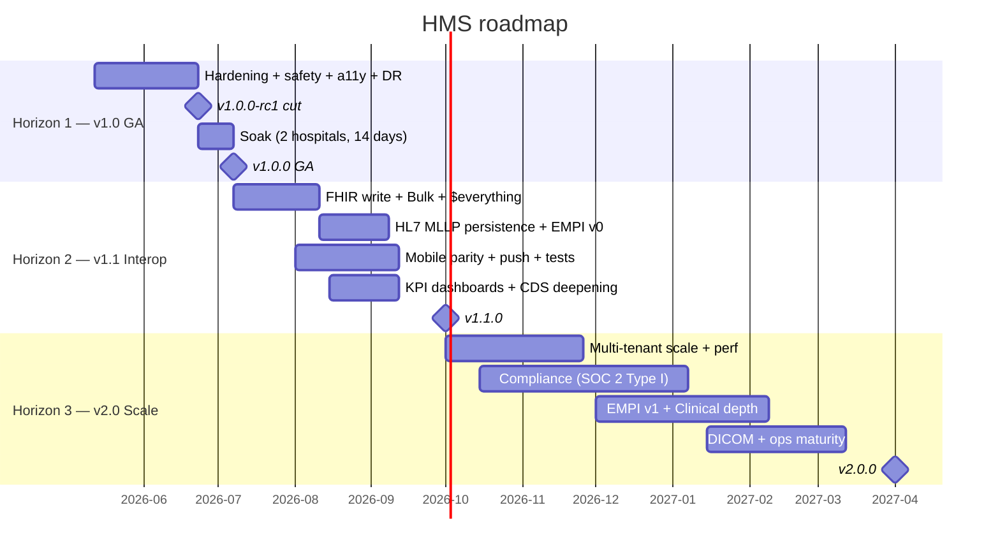

# HMS Roadmap

Canonical roadmap for the Hospital Management System project. Source of truth for
"what is shipped vs. planned vs. deferred". Two companion exports:

- [`roadmap.csv`](./roadmap.csv) — flat machine-readable, for Jira / Linear / Notion /
  Airtable / GitHub Projects import.
- [`roadmap.xlsx`](./roadmap.xlsx) — pre-formatted spreadsheet (bold + frozen header,
  auto-filter, color-coded horizons + statuses) for stakeholders who prefer Excel /
  Numbers / Sheets. Generated from the CSV; do not hand-edit — re-export instead.

Last updated: **2026-05-10**. Update both files together when scope moves.

> **2026-05-10 update — v1.0 finishing line + a11y smoke landed.** Rows 4
> (T-68 offline dispense queue), 5 (T-71 Playwright E2E), 6 (T-72 perf
> baseline), 8 (Keycloak Phase C cutover) and 10 (axe-core/playwright
> smoke) all flipped from `not-started` (or `started`) to `completed`.
> Of the twelve v1.0 rows, only row 11 (Keyboard navigation pass — was
> blocked on row 10, now unblocked, also picks up the `color-contrast`
> cleanup deferred from row 10) and row 13 (`v1.0.0-rc1` cut, gates on
> all of v1.0) remain. See merge commits
> [`929f2307`](https://github.com/DevFaso/hms/commit/929f2307) (PR #286,
> a11y smoke) and
> [`b7affa7e`](https://github.com/DevFaso/hms/commit/b7affa7e) (PR #287,
> rows 4/5/6/8).

## Where the project is today

| Layer | Maturity | Notes |
| --- | --- | --- |
| Backend (`hospital-core`, Spring Boot 3.4) | Production-ready | 83 services, 393 JUnit tests, 80% JaCoCo gate enforced |
| Web UI (`hospital-portal`, Angular 20) | Production-ready | 61 feature modules, 95 specs, EN/FR/ES |
| Patient Android (`patient-android-app`) | Real app, screens at parity | 67 Kotlin/Java files, 5 tests — coverage thin |
| Patient iOS (`patient-ios-app`) | Real app, screens at parity | 42 Swift files, 5 tests — coverage thin |
| Auth (Keycloak / OIDC) | Phase 6 done — RS256, OIDC RS, MFA | Phase 7 cutover deferred |
| Observability | Grafana stack + Splunk HEC just landed (#273, #276) | No DR runbook, no synthetic monitoring |
| Interop | FHIR R4 read-only (6 resources), HL7 MLLP listener (parse+ACK only), CDS Hooks 1.0, SMART-on-FHIR discovery | All read/discovery only |
| Compliance | BF 2021 data law + ANSSI hardening | No SOC 2 / HIPAA / BAA |
| Releases | `v0.1.0`, `v0.1.0-rc1` | Pre-1.0 |

## Timeline overview



---

## Horizon 1 — `v1.0 "GA-ready hardening"` (~6 weeks, 2026-05-12 → 2026-06-23)

**Goal:** turn `v0.1.0` into a release the first three customer hospitals can run unattended for 14 days.

### 1.1 Clinical safety

- **CDS Hooks expansion** — add `order-select` and `medication-prescribe` hooks with RxNorm bindings; integration tests against the existing prescriptions module. *Effort: M (2w). Owner: Backend.*
- **Drug-drug interaction check** — extend `hms-medication-allergy-check` to also fire on coexisting prescriptions; warn-card on critical interactions. *Effort: M. Owner: Backend + UI.*

### 1.2 Pharmacy v1.x cleanup (the deferred 14% in `pharmacy-implementation-plan.md`)

- **T-68 offline dispense queue** — IndexedDB queue in pharmacy UI + replay endpoint; covers hospitals with patchy connectivity. *Effort: M. Owner: Frontend + Backend.*
- **T-71 Playwright E2E** — one E2E test per dispense path (Tier 1 in-house, Tier 2 partner, refill, AMU export). *Effort: S. Owner: Frontend.*
- **T-72 perf baseline** — k6 script @ 50 concurrent dispenses, p95 < 800ms; recorded in `docs/observability/performance-baseline.md`. *Effort: S. Owner: Platform.*

### 1.3 Security finish line (the deferred 12% in `security-hardening-plan.md`)

- **Idle session timeout (server-side)** — last-activity tracked in Redis; reject after 15min idle; JWT silent refresh respects window. *Effort: M. Owner: Backend.*
- **Keycloak Phase C cutover** — flip `OIDC_REQUIRED=true` in UAT, soak 7 days, then prod; legacy `/auth/login` returns 410 Gone. *Effort: S (after soak). Owner: Backend.*
- **DR runbook** — `docs/runbooks/disaster-recovery.md` covering Railway snapshot+restore, Postgres PITR, observability stack rebuild. *Effort: S. Owner: Platform.*

### 1.4 Accessibility baseline

- **`@axe-core/playwright` smoke check** — fail PR on any new violation across login, doctor dashboard, patient tracker, AVS. *Effort: S. Owner: Frontend.*
- **Keyboard-navigation audit** — all clinical-flow screens reachable + actionable via keyboard; `docs/ui/accessibility.md`. *Effort: M. Owner: Frontend.*

### 1.5 i18n completion

- **FR completeness gate** — extract all `*.json` keys, fail CI when any locale is < 99% of EN; enforced in `frontend-ci.yml`. *Effort: S. Owner: Frontend.*

### 1.6 Release engineering

- **`v1.0.0-rc1` cut** — tag, signed release notes from `CHANGELOG.md`, `feat/*` freeze for 1 week, only `fix/*` allowed during soak. *Effort: S. Owner: Platform.*

### Exit criteria for `v1.0.0`

1. Two customer hospitals running `v1.0.0-rc1` for ≥14 days with zero P1 incidents.
2. JaCoCo ≥80% (already met) **and** Playwright E2E green for the seven core MVPs.
3. DR drill executed — restore from snapshot in <30min, RPO ≤24h.
4. Zero high-severity Dependabot alerts on default branch (currently 2 open).

---

## Horizon 2 — `v1.1 "Interop expansion"` (~Q3 2026)

**Goal:** make HMS a credible node in the Burkina Faso / ECOWAS health-information ecosystem.

### 2.1 FHIR R4 — write + bulk

- **FHIR write API** — POST/PUT for Patient, Encounter, Observation; conditional create via `If-None-Exist`; `metadata` updated. *Effort: L (4w). Owner: Backend.*
- **Bulk Data Access (`$export`)** — Patient and Group; output to S3-compatible bucket; `docs/fhir-bulk.md`. *Effort: M. Owner: Backend.*
- **`$everything` operation** — Patient compartment export, required by most HIE handshakes. *Effort: M. Owner: Backend.*

### 2.2 HL7 v2 MLLP — close the loop

- **ORU^R01 → LabResult persistence** — match by accession number, write to existing `lab_result` schema, link to encounter; integration test with real Mindray/Sysmex sample messages. *Effort: M. Owner: Backend.*
- **ADT^A01/A04/A08 → Admission/Encounter sync** — same pattern; conflict-resolution rules documented. *Effort: M. Owner: Backend.*

### 2.3 EMPI v0 (intra-tenant)

- **Probabilistic match** — name + DOB + sex + national-ID where present; "candidate match" workflow in receptionist UI; ≥90% recall on labelled audit set. *Effort: L. Owner: Backend + Frontend.*

### 2.4 CDS Hooks deepening

- **LOINC binding for `hms-patient-view`** — currently ICD-only; add LOINC for problem terminology. *Effort: S. Owner: Backend.*
- **Public hooks discovery** — `/api/cds-services` validated against Cerner and Epic CDS Hooks sandbox. *Effort: S. Owner: Backend.*

### 2.5 Patient mobile parity

- **Referrals + Treatments + Billing screens** in Android + iOS — every web feature a patient uses gets a mobile screen. *Effort: L per platform. Owner: Mobile.*
- **Push notifications for lab results** — FCM/APNs (already wired backend-side) + UI toggles + deep-link to `LabResultsDetail`. *Effort: M. Owner: Mobile + Backend.*
- **Mobile test coverage** — bring per-app count from 5 → 30+ (unit + UI snapshots); add Detox or Maestro for E2E. *Effort: M per platform. Owner: Mobile.*

### 2.6 Reporting

- **KPI dashboard service** — materialized views for door-to-doctor, dispense lead time, no-show rate; surfaced in existing `analytics/` module. *Effort: M. Owner: Backend + Frontend.*

### Exit criteria for `v1.1.0`

1. Successful interop demo with one external lab (HL7 v2 over MLLP) **and** one FHIR sandbox (R4 read+write).
2. EMPI matches ≥90% of duplicate-candidate pairs in a labelled audit set.
3. Mobile parity: every clinical task a patient does on the web portal is doable on iOS and Android.

---

## Horizon 3 — `v2.0 "Scale + compliance"` (~2027)

**Goal:** be deployable in 10+ hospitals across the region without a per-customer fork.

### 3.1 Multi-tenancy at scale

- **Schema-per-tenant migration path** — current row-level multi-tenancy stays default; schema-per-tenant for hospitals with strong isolation needs (military, private foreign). *Effort: XL. Owner: Backend + Platform.*
- **Tenant onboarding pipeline** — one-command provision: realm, schema, seed data, observability namespace, Splunk index. *Effort: L. Owner: Platform.*

### 3.2 Performance

- **Read replicas + Hikari tuning** — pool sized to actual concurrent users; RO replica routing for FHIR reads + dashboards. *Effort: M. Owner: Backend.*
- **Async/event-driven dispense + lab** — move ORU result and dispense settlement to Kafka consumers; reduce request-thread blocking. *Effort: L. Owner: Backend.*

### 3.3 Compliance pathway

- **SOC 2 Type I → Type II** — control map: existing audit logs, RBAC, encryption already cover ~60% of CC1–CC9; gap analysis in `docs/compliance/soc2-gap.md`. *Effort: XL (12-month observation window). Owner: Compliance + Backend.*
- **HIPAA-equivalent posture for international customers** — BAA template, PHI inventory, key rotation, access review cadence. *Effort: L. Owner: Compliance.*
- **ECOWAS data-residency support** — per-tenant region pinning (Railway → AWS or OVH-Africa); required for Senegal/Côte d'Ivoire/Ghana. *Effort: L. Owner: Platform.*

### 3.4 Patient identity v1

- **EMPI v1 (cross-tenant)** — national-ID-keyed, with explicit patient consent record per data-sharing event; FHIR `Consent` resource. *Effort: L. Owner: Backend.*

### 3.5 Clinical depth

- **OB/GYN + pediatrics modules** — finish the partially-designed `HighRiskPregnancyCarePlan*`, `NewbornAssessment*`, `PostpartumCare*` services. *Effort: L. Owner: Backend + Frontend.*
- **DICOM proxy** — extend existing `imaging` module with Orthanc / dcm4chee adapter for actual image viewing. *Effort: L. Owner: Backend + Frontend.*

### 3.6 Operations maturity

- **Synthetic monitoring** — Grafana k6 cloud or Blackbox-exporter probes from 3 geos; alert on > 10% probe failure for 5min. *Effort: S. Owner: Platform.*
- **Cost observability** — tag every Splunk event + Grafana series with `tenant`; chargeback report per hospital. *Effort: M. Owner: Platform.*

### Exit criteria for `v2.0.0`

1. 10 paying hospital tenants on a single multi-tenant prod cluster.
2. Independent SOC 2 Type II audit started (12-month observation window).
3. Per-tenant cost recoverable from observability data.

---

## Explicitly out of scope

| Item | Why deferred |
| --- | --- |
| AI/LLM clinical features | Trendy, regulatorily risky in healthcare, no existing groundwork in this repo. Revisit after v1.0 foundations are solid. |
| Splunk Observability Cloud (metrics) | Duplicates the OTel→Grafana Cloud path landed in #276. |
| Jenkins | GitHub Actions covers CI/CD already; Jenkins would be a parallel system to maintain. |
| Direct LDAP/Kerberos in `hospital-core` | Auth concerns belong in Keycloak; configure user federation there per-deployment. |
| Revenue-cycle / claims-management module | Out of scope for clinical+pharmacy MVP; partner with a billing vendor instead. |

## How this roadmap is maintained

- **Cadence:** review every 4 weeks during the v1.0 push, monthly thereafter.
- **Source of truth:** `docs/roadmap.csv` is the canonical data; `docs/roadmap.md` and
  `docs/roadmap.xlsx` are presentations of it. Edit the CSV when scope moves, then
  re-render the xlsx (see "Regenerating roadmap.xlsx" below) and update the narrative
  in this file.
- **Status field in CSV** — controlled vocabulary, exactly six allowed values:

  | Value | Meaning |
  | --- | --- |
  | `not-started` | Work has not begun. Default state for every new row. |
  | `started` | Actively in flight — a branch exists, a PR is open, or a person is heads-down on it this week. |
  | `blocked` | Work paused on an external dependency or decision. Always pair with a one-line note in the `deliverable` cell explaining what is blocking. |
  | `completed` | Shipped. The deliverable described in the row is verifiable on the listed branch / runbook. |
  | `deferred` | Still on the roadmap but moved to a later horizon. The row stays in place; only the `horizon` cell changes. |
  | `dropped` | Explicitly removed from the roadmap. Kept as a row so future readers see the decision; never delete. |

  The build script's color palette in `scripts/build-roadmap-xlsx.py` keys off these
  exact strings — adding a new value without updating both places is a bug.
- **PR template hint:** when a PR closes a roadmap item, reference its row by `lane /
  item` so the changelog can pivot back here.

### Regenerating `roadmap.xlsx`

```bash
python3 -m venv /tmp/xlsx-venv && /tmp/xlsx-venv/bin/pip install -q openpyxl
/tmp/xlsx-venv/bin/python scripts/build-roadmap-xlsx.py
```

The xlsx applies a fixed style (frozen + bold header, auto-filter, light-green/yellow/
orange backgrounds for horizons v1.0/v1.1/v2.0, gray for out-of-scope, status-tinted
status column). If the styling needs to change, edit
[`scripts/build-roadmap-xlsx.py`](../scripts/build-roadmap-xlsx.py), not the xlsx
directly.
